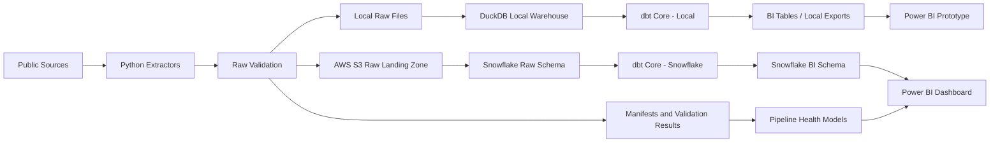

# Small Business Lending Intelligence Pipeline

## Overview

The Small Business Lending Intelligence Pipeline is an end-to-end analytics engineering project that tracks SBA small-business lending activity and regional business-health indicators across the United States.

The project ingests public SBA, Census, and BLS data; stores immutable raw extracts in AWS S3; models clean analytical tables with DuckDB, Snowflake, and dbt Core; validates data quality with Python checks, pytest, and dbt tests; orchestrates refreshes with Prefect; and publishes stakeholder-facing KPIs in Power BI.

## One-Sentence Pitch

Built a production-style SQL/Python analytics pipeline that ingests public SBA, Census, and BLS data into S3, models lending and business-health KPIs with dbt and Snowflake, validates data quality, and publishes a Power BI dashboard for regional small-business lending analysis.

## Business Problem

Public small-business lending and economic data is available, but it is fragmented across different sources, grains, formats, and refresh cadences. Business stakeholders need modeled, validated, dashboard-ready KPI tables that answer questions such as:

- Where is SBA lending increasing or declining?
- Which states, industries, and lenders drive approved loan volume?
- How concentrated is lending among top lenders?
- How does lending activity compare with business formation and unemployment context?
- Is the data fresh, tested, and traceable back to raw source extracts?

## Architecture



## Tech Stack

| Layer | Tools |
|---|---|
| Ingestion | Python, requests, pandas |
| Raw storage | AWS S3, local raw mirror |
| Local warehouse | DuckDB |
| Final warehouse | Snowflake |
| Transformations | dbt Core |
| Orchestration | Prefect |
| Data quality | Python validation, pytest, dbt tests |
| Runtime | Docker, Makefile, environment variables |
| BI | Power BI |

## Data Sources

| Source | Publisher | Role | Access Pattern | Grain |
|---|---|---|---|---|
| SBA 7(a) and 504 FOIA | U.S. Small Business Administration | Core lending data | Public CSV files | Loan record |
| Census Business Dynamics Statistics | U.S. Census Bureau | Business formation / establishment context | Census API | State-year |
| BLS Local Area Unemployment Statistics | U.S. Bureau of Labor Statistics | Labor-market context | BLS API | State-month |

## Core KPIs

| Category | Example KPIs |
|---|---|
| Lending volume | Approved loan amount, loan count, average loan size |
| Lending trend | YoY approved amount growth, YoY loan count growth |
| Lender concentration | Top 1 lender share, top 5 lender share, active lender count |
| Industry mix | Approved amount by NAICS sector, industry share, average loan size by sector |
| Program mix | 7(a) versus 504 approved amount and share |
| Regional context | Loans per 1,000 establishments, dollars per establishment, establishment entry rate |
| Labor-market context | Unemployment rate, YoY unemployment percentage-point change |
| Pipeline health | Source freshness, validation pass rate, latest successful run, dbt test status |

## Power BI Dashboard Pages

1. **Executive Overview** — headline lending KPIs, state ranking, annual trends, freshness indicator.
2. **State Lending Trends** — monthly lending trends and descriptive unemployment comparison.
3. **Lender Concentration** — top lenders, lender share, active lender count, concentration trends.
4. **Industry and Program Mix** — NAICS sector lending and 7(a) versus 504 mix.
5. **Regional Business Health** — lending normalized by establishments and business-health context.
6. **Data Quality and Pipeline Health** — source freshness, validation pass rate, row counts, failed/warning checks.

## Repository Structure

```text
small-business-lending-pipeline/
├── README.md
├── Dockerfile
├── docker-compose.yml
├── Makefile
├── .env.example
├── requirements.txt
├── config/
├── docs/
├── pipelines/
│   ├── extract/
│   ├── load/
│   ├── validation/
│   ├── flows/
│   └── utils/
├── dbt/
│   ├── models/
│   ├── seeds/
│   ├── macros/
│   └── tests/
├── tests/
├── data/
├── powerbi/
│   ├── lending_dashboard.pbix
│   └── screenshots/
└── scripts/
```

## Local Run

```bash
cp .env.example .env
make install
make test
make run-local
```

Equivalent direct command:

```bash
python -m pipelines.flows.lending_pipeline_flow \
  --run-mode local \
  --dbt-target dev_duckdb
```

## Final Warehouse Run

Final mode requires AWS S3 and Snowflake configuration.

```bash
make run-final
```

Equivalent direct command:

```bash
python -m pipelines.flows.lending_pipeline_flow \
  --run-mode final \
  --dbt-target prod_snowflake
```

## Data Quality Strategy

The project uses layered validation:

| Layer | Checks |
|---|---|
| Raw extraction | API/file status, file exists, row count, checksum, schema hash, manifest |
| Staging | Not-null keys, type parsing, accepted values, state mappings |
| Marts | Unique grains, non-negative metrics, valid rates/shares, reconciliations |
| BI | Required tables exist, rows present, no raw borrower-level exposure |
| Pipeline health | Freshness, validation pass rate, dbt test status, latest successful run |

Core rule:

```text
No unvalidated source data should become a published KPI.
```

## Scope Boundaries

This project intentionally excludes:

- predictive machine learning;
- borrower-level credit scoring;
- loan approval prediction;
- default prediction;
- real-time streaming;
- AWS Glue, Lambda, Step Functions, Athena, and Redshift for MVP;
- causal claims about business formation, unemployment, and lending.

The goal is analytics engineering: reliable ingestion, tested SQL models, documented KPIs, orchestration, and BI delivery.

## Documentation

| Document | Purpose |
|---|---|
| `docs/project_spec.md` | Project brief, business problem, analytical questions, scope |
| `docs/data_source_inventory.md` | Public source inventory, source grains, access methods, limitations |
| `docs/kpi_definitions.md` | KPI formulas, grains, caveats, dashboard formatting |
| `docs/data_dictionary.md` | Canonical fields and modeled entity dictionary |
| `docs/data_model.md` | Raw, staging, intermediate, mart, BI, and audit model design |
| `docs/architecture.md` | End-to-end technical architecture |
| `docs/testing_plan.md` | Python validation, pytest, dbt tests, quality gates |
| `docs/orchestration_runtime.md` | Prefect flow, Docker runtime, commands, failure behavior |
| `docs/dashboard_spec.md` | Power BI pages, visuals, interactions, acceptance criteria |
| `docs/implementation_checklist.md` | Build order and completion checklist |

## Recruiter Review Signals

This project demonstrates:

- SQL and dimensional modeling;
- Python API/CSV ingestion;
- AWS S3 raw data landing;
- Snowflake warehouse modeling;
- dbt transformations and tests;
- pytest-based Python testing;
- Prefect orchestration;
- Dockerized development;
- Power BI dashboard design;
- KPI documentation and governance habits.

## Limitations

- SBA FOIA data represents public SBA 7(a) and 504 lending records, not all small-business lending.
- Approved loan amount measures approval activity, not repayment, default, delinquency, or loss performance.
- Census BDS is annual and may lag current conditions.
- BLS LAUS data can be revised.
- Cross-source comparisons are descriptive, not causal.
- The MVP does not train or deploy predictive models.
