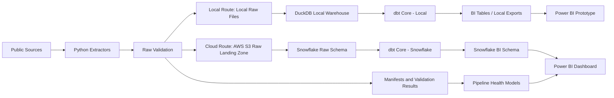

# Small Business Lending Intelligence Pipeline

## Overview

The Small Business Lending Intelligence Pipeline is an end-to-end analytics engineering project that tracks SBA small-business lending activity and regional business-health indicators across the United States.

The project ingests public SBA, Census, and BLS data; stores immutable raw extracts in AWS S3; models clean analytical tables with DuckDB, Snowflake, and dbt Core; validates data quality with Python checks, pytest, and dbt tests; orchestrates refreshes with Prefect; and publishes stakeholder-facing KPIs in Power BI.

## One-Sentence Pitch

Built a production-style SQL/Python analytics pipeline that ingests public SBA, Census, and BLS data into S3, models lending and business-health KPIs with dbt and Snowflake, validates data quality, and publishes a Power BI dashboard for regional small-business lending analysis.

## Business Problem

Public small-business lending and economic data is available, but it is fragmented across different sources, grains, formats, and refresh cadences. Business stakeholders need modeled, validated, dashboard-ready KPI tables that answer questions such as:

- Where is SBA lending increasing or declining?
- Which states, industries, and lenders drive approved loan volume?
- How concentrated is lending among top lenders?
- How does lending activity compare with business formation and unemployment context?
- Is the data fresh, tested, and traceable back to raw source extracts?

## Architecture



## Tech Stack

| Layer | Tools |
|---|---|
| Ingestion | Python, requests, pandas |
| Raw storage | AWS S3, local raw mirror |
| Local warehouse | DuckDB |
| Final warehouse | Snowflake |
| Transformations | dbt Core |
| Orchestration | Prefect |
| Data quality | Python validation, pytest, dbt tests |
| Runtime | Docker, Makefile, environment variables |
| BI | Power BI |

## Runtime Routes

The pipeline has two intentional execution routes.

| Route | Purpose | Storage and warehouse | Output |
|---|---|---|---|
| Local | Fast development, debugging, tests, and Power BI prototyping on one machine | Local raw files and DuckDB | Local BI export CSVs |
| Cloud | Production-style portfolio run that shows cloud raw landing and warehouse modeling | AWS S3 and Snowflake | Snowflake BI schema |

DuckDB and Snowflake play the same warehouse role in different environments. S3 owns durable cloud raw payloads, manifests, validation outputs, and dbt artifacts. dbt owns the transformation graph, tests, documentation, and lineage for both routes.

Use the local route while developing or auditing the model logic. Use the cloud route when you want recruiter-visible evidence of S3 raw storage, Snowflake raw/BI schemas, and dbt running against the cloud warehouse.

Compatibility/testing helpers still exist for narrow checks, such as uploading local artifacts to S3 for smoke tests, fallback verification, and debugging. Snowflake raw loading now belongs to the cloud route and reads S3-backed artifacts through the Snowflake stage loader. The intended route ownership is:

- Local only: local raw files, local manifests and validation JSON, DuckDB, and local BI exports.
- Cloud only: S3 raw payloads, S3 manifests and validation output, Snowflake raw/BI schemas, and dbt against Snowflake.

## Data Sources

| Source | Publisher | Role | Access Pattern | Grain |
|---|---|---|---|---|
| SBA 7(a) and 504 FOIA | U.S. Small Business Administration | Core lending data | Public CSV files | Loan record |
| Census Business Dynamics Statistics | U.S. Census Bureau | Business formation / establishment context | Census API | State-year |
| BLS Local Area Unemployment Statistics | U.S. Bureau of Labor Statistics | Labor-market context | BLS API | State-month |

## Core KPIs

| Category | Example KPIs |
|---|---|
| Lending volume | Approved loan amount, loan count, average loan size |
| Lending trend | YoY approved amount growth, YoY loan count growth |
| Lender concentration | Top 1 lender share, top 5 lender share, active lender count |
| Industry mix | Approved amount by NAICS sector, industry share, average loan size by sector |
| Program mix | 7(a) versus 504 approved amount and share |
| Loan performance | Status mix, gross charge-off dollars, charge-off dollar rate, charged-off loan count rate |
| Terms, pricing, and financing | Average term, interest-rate coverage, average initial interest rate, 7(a) guarantee rate, 504 third-party financing |
| Jobs-supported context | Source-reported jobs supported, jobs per loan, jobs per `$1M` approved, dollars per reported job |
| Regional context | Loans per 1,000 establishments, dollars per establishment, establishment entry rate |
| Labor-market context | Unemployment rate, YoY unemployment percentage-point change |
| Pipeline health | Source freshness, validation pass rate, latest successful run, dbt test status |

Extra SBA KPIs use only fields already present in the SBA FOIA data. They do not
claim application volume, approval rates, denial rates, borrower credit risk, or
unmet demand. Interest-rate fields are coverage-aware and primarily available for
7(a). Jobs-supported metrics are descriptive source-reported indicators, not
causal job-creation claims.

## Power BI Dashboard Pages

1. **Executive Overview** — headline lending KPIs, state ranking, annual trends, freshness indicator.
2. **State Lending Trends** — monthly lending trends and descriptive unemployment comparison.
3. **Lender Concentration** — top lenders, lender share, active lender count, concentration trends.
4. **Industry and Program Mix** — NAICS sector lending and 7(a) versus 504 mix.
5. **Regional Business Health** — lending normalized by establishments and business-health context.
6. **Data Quality and Pipeline Health** — source freshness, validation pass rate, row counts, failed/warning checks.

The dbt and Power BI contracts now include extra SBA KPI tables for future
report pages, but adding or revising PBIX visuals remains a manual Power BI
Desktop step.

## Screenshots

Dashboard, dbt, Prefect, S3, and Snowflake evidence screenshots are local
artifacts captured as the implementation reaches the relevant milestones. The
`powerbi/screenshots/` directory is kept in Git with `.gitkeep`; generated
screenshots are ignored by default.

## Repository Structure

```text
small-business-lending-pipeline/
├── README.md
├── Dockerfile
├── docker-compose.yml
├── .dockerignore
├── Makefile
├── .env.example
├── requirements.txt
├── config/
├── docs/
├── pipelines/
│   ├── cli/
│   ├── extract/
│   ├── flows/
│   ├── load/
│   ├── powerbi/
│   ├── storage/
│   ├── validation/
│   └── utils/
├── dbt/
│   ├── models/
│   ├── seeds/
│   ├── macros/
│   └── tests/
├── tests/
├── data/
├── powerbi/
│   ├── lending_dashboard.pbix
│   ├── lending_dashboard_model.json
│   ├── power_query/
│   └── screenshots/
└── scripts/
```

## Local Run

```bash
cp .env.example .env
make install
make test
make run-local-fixture
```

Local route output:

- DuckDB database at `data/warehouse/small_business_lending.duckdb`;
- dbt models built with target `dev_duckdb`;
- Power BI-ready CSV exports under `data/exports/powerbi/...`.

`make run-local` remains a fixture-safe compatibility alias for
`make run-local-fixture`. Use the live local route only when you intentionally
want to download current source data and spend the extra local disk, memory, and
runtime:

```bash
make run-local-live
```

Equivalent fixture command:

```bash
python -m pipelines.flows.lending_pipeline_flow \
  --run-mode local \
  --extract-mode fixture \
  --dbt-target dev_duckdb
```

## Testing

```bash
make install
make test
make dbt-local
```

`make dbt-local` is the WSL-safe dbt verification path; it compiles the local dbt graph without running the full live-data DuckDB build. When you intentionally want the heavier full local dbt build, use:

```bash
make dbt-build-local-full
```

The local command taxonomy separates cheap checks from expensive work:

- `make run-local-fixture`: fixture-backed local smoke route.
- `make run-local-live`: live-source local route.
- `make benchmark-local COMMAND="make dbt-local"`: benchmark wrapper for local command timing and disk/RAM evidence.
- `make dbt-build-local-fast`: iteration build with critical dbt tests.
- `make dbt-build-local-full`: full local dbt build and validation.
- `make powerbi-refresh-local`: fast local BI refresh route; runs fast dbt mode, exports CSVs, and checks the Power BI model contract.

## Container Runtime

Docker is a reproducibility check for the Python/dbt runtime, not a separate
pipeline implementation. The default container builds dependencies from
`requirements.txt` through `make install` and runs the same Makefile command path
used locally.

```bash
docker compose up --build
```

The default Compose service does not bind-mount the repository, so the image's
local `.venv` remains available inside `/app`. Use a Compose override file for
interactive bind-mounted development if needed.

Local generated data can be previewed for cleanup with:

```bash
make cleanup-local-data-dry-run
```

Apply the cleanup only after reviewing the listed paths:

```bash
make cleanup-local-data
```

## Cloud Warehouse Run

Cloud mode requires AWS S3 and Snowflake configuration.
Snowflake must have a storage integration that can read the configured S3 bucket,
and `SNOWFLAKE_STORAGE_INTEGRATION` should name that integration.

```bash
make run-cloud
```

Equivalent direct command:

```bash
python -m pipelines.flows.lending_pipeline_flow \
  --run-mode cloud \
  --dbt-target prod_snowflake
```

For a small cloud smoke that does not replace the main Snowflake schemas, run the
cloud fixture route with isolated schemas:

```bash
RAW_SCHEMA=SMOKE_RAW \
SNOWFLAKE_AUDIT_SCHEMA=SMOKE_AUDIT \
SNOWFLAKE_SCHEMA=SMOKE \
DBT_SCHEMA_PREFIX=SMOKE \
SNOWFLAKE_BI_SCHEMA=SMOKE_BI \
scripts/run_cloud_pipeline.sh --extract-mode fixture
```

Cloud route output:

- raw source artifacts in `s3://<bucket>/raw/...`;
- source manifests in `s3://<bucket>/manifests/...`;
- raw validation results and dbt artifacts in `s3://<bucket>/validation/...`;
- Snowflake `RAW`, `STAGING`, `INTERMEDIATE`, `MARTS`, `BI`, and `AUDIT` schemas;
- dbt models built with target `prod_snowflake`;
- Power BI connects to Snowflake BI tables, not raw files.

The local and cloud routes build the same dbt BI contract. Local runs export
`BI_EXPORT_TABLES` as CSV files under `data/exports/powerbi`; cloud runs build
the same logical BI table names in the configured Snowflake BI schema. The extra
SBA KPI contract includes `bi_lending_performance`, `bi_lending_status_mix`,
`bi_lending_terms_pricing`, and `bi_lending_jobs_impact`.

dbt and Snowflake raw loading both use `RAW_SCHEMA` for the raw warehouse schema.

The cloud route is still launched by the local CLI/Prefect runner for the MVP. Temporary runner files may exist while a task runs, but the durable cloud handoff is S3 object identity plus Snowflake tables. Run summaries record the local compatibility validation path, the durable validation URI, and manifest artifact URIs when cloud artifacts are present.

## Data Quality Strategy

The project uses layered validation:

| Layer | Checks |
|---|---|
| Raw extraction | API/file status, file exists, row count, checksum, schema hash, manifest |
| Staging | Not-null keys, type parsing, accepted values, state mappings |
| Marts | Unique grains, non-negative metrics, valid rates/shares, reconciliations |
| BI | Required tables exist, rows present, no raw borrower-level exposure |
| Pipeline health | Freshness, validation pass rate, dbt test status, latest successful run |

Core rule:

```text
No unvalidated source data should become a published KPI.
```

## Scope Boundaries

This project intentionally excludes:

- predictive machine learning;
- borrower-level credit scoring;
- loan approval prediction;
- default prediction;
- real-time streaming;
- AWS Glue, Lambda, Step Functions, Athena, and Redshift for MVP;
- causal claims about business formation, unemployment, and lending.

The goal is analytics engineering: reliable ingestion, tested SQL models, documented KPIs, orchestration, and BI delivery.

## Documentation

| Document | Purpose |
|---|---|
| `docs/detailed/project_spec.md` | Project brief, business problem, analytical questions, scope |
| `docs/detailed/data_source_inventory.md` | Public source inventory, source grains, access methods, limitations |
| `docs/detailed/kpi_definitions.md` | KPI formulas, grains, caveats, dashboard formatting |
| `docs/detailed/data_dictionary.md` | Canonical fields and modeled entity dictionary |
| `docs/detailed/data_model.md` | Raw, staging, intermediate, mart, BI, and audit model design |
| `docs/detailed/architecture.md` | End-to-end technical architecture |
| `docs/detailed/testing_plan.md` | Python validation, pytest, dbt tests, quality gates |
| `docs/detailed/orchestration_runtime.md` | Prefect flow, Docker runtime, commands, failure behavior |
| `docs/detailed/dashboard_spec.md` | Power BI pages, visuals, interactions, acceptance criteria |
| `docs/detailed/implementation_checklist.md` | Original build-order checklist |

## Recruiter Review Signals

This project demonstrates:

- SQL and dimensional modeling;
- Python API/CSV ingestion;
- AWS S3 raw data landing;
- Snowflake warehouse modeling;
- dbt transformations and tests;
- pytest-based Python testing;
- Prefect orchestration;
- Dockerized development;
- Power BI dashboard design;
- KPI documentation and governance habits.

## Limitations

- SBA FOIA data represents public SBA 7(a) and 504 lending records, not all small-business lending.
- Approved loan amount measures approval activity, not repayment, default, delinquency, or loss performance.
- Census BDS is annual and may lag current conditions.
- BLS LAUS data can be revised.
- Cross-source comparisons are descriptive, not causal.
- The MVP does not train or deploy predictive models.
