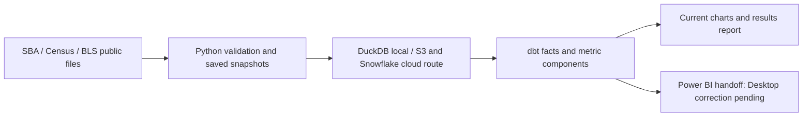

# Where SBA loan approval activity is concentrated

**More reported dollars can coexist with fewer approval records. Large state totals
and high activity relative to local businesses also tell different stories.**

I built this personal analytics engineering project to make those comparisons
reproducible and defensible. It turns public U.S. Small Business Administration
(SBA) approval records, Census business counts and Bureau of Labor Statistics
(BLS) labor data into validated snapshots, tested SQL models and readable reports.

**My contribution:** source adapters and validation, local/cloud pipeline wiring,
dbt metric definitions, reporting contracts and checks, reproducible charts, and
the Power BI model handoff. The public agencies supply the data; DuckDB, dbt,
Prefect and Power BI supply the database, transformation, orchestration and BI tools.

**Current deliverable:** the six generated data charts and reader report are current
to the saved October 5, 2026 inputs. Power BI Desktop delivery is pending; the
outdated binary and screenshots have been withdrawn from the public repository.
The S3/Snowflake route is implemented;
paid live execution is deferred. See the [artifact status and handoff](powerbi/README.md).

For a quick review, read the findings below. The
[case study](docs/detailed/case_study.md) explains the engineering decisions and
recorded performance evidence. The [results report](docs/detailed/analysis_results.md)
contains all six charts, exact aggregate tables and source coverage.

## How did approval activity change?


In **2025**, the latest complete lending year in these inputs, reported amounts
reached **$40.93 billion**, up **1.71%** from 2024. Approval records fell from
**81,081 to 74,098**. The average reported amount was **$552,334**, using records
with known amounts as its denominator. A dollar trend alone misses the change in volume.

The population covers **50 states and Washington, DC**, with recognized project
geography and calendar approval dates. Amounts are nominal and include canceled
or not-funded approvals; records are not disbursements or unique borrowers.
[7(a)](https://www.sba.gov/loans/7a-loans/) supports general business uses and
reports whole loans. [504](https://www.sba.gov/loans/504-loans/) supports major
fixed assets and reports the SBA/Certified Development Company portion. Adding
these amounts describes reported approval activity, not total project financing.

## Where does geography change the answer?


In **2023**, California led reported dollar volume at **$5.06 billion**. Ohio led
approval records per 1,000 employer business locations at **15.92**, followed by
Utah (**14.06**) and New Hampshire (**13.43**). Census calls these locations
*employer establishments*: they include firms of all sizes and exclude businesses
without employees. This comparison describes activity relative to the business
base; it does not measure credit access or unmet demand.

Both sides use 2023, the latest complete year with business and labor context.
This is separate from the 2025 lending view. That view adds detail: **7(a) accounts
for 82.33%** of reported amounts; **accommodation and food services leads known-industry
amounts at 17.34%**; and **five reporting lender names account for 20.93%** of known-name
dollars. Names cover 100.00% of 2025 dollars, but do not resolve historical
originators or consolidated banking groups. See the
[distribution charts and denominators](docs/detailed/analysis_results.md#what-makes-up-the-total--2025).

## How the implementation supports the story

Python preserves and validates source files. Prefect coordinates the stages;
DuckDB supports local SQL analysis, with an implemented S3/Snowflake cloud route.
dbt defines eligible records and additive metric components. Power BI combines
those components within the user's filters.



The engineering decisions include distinguishing unknown amounts from zero,
matching source periods, ranking lender names after combining the selected states,
and checking publication timelines rather than treating old observations as stale.
A recorded loader benchmark reduced wall time from **28.6 to 18.069 seconds**
and peak memory from **about 4.7 GB to 2.0 GB**, with matching source row counts.
This is a historical benchmark, not a new performance claim. The
[case study](docs/detailed/case_study.md#engineering-choices-and-proof) explains
that result and an optimization rejected because it made the full refresh slower.

The October local data rebuild passed **328 real-data dbt tests**. A later
readiness check matched **18 reporting CSVs / 253,942 rows** to modeled tables and
checked **25 relationships**. Chart generation verifies the six consumed CSV
hashes and reconciles category components before publication. The
[public verification record](docs/images/lending_verification.json) distinguishes
those scopes. [CI results](https://github.com/stevennitesh/small-business-lending-pipeline/actions/workflows/ci.yml)
cover code and report contracts; the [dated verification appendix](docs/implementation/lending_verification_history.md)
records checks already performed. CI does not certify the Desktop binary or live cloud data.

## Reproduce locally

Use **Linux/WSL with Python 3.12 and Make**, or Docker. The lightweight runtime gate
uses no live source downloads or cloud credentials:

```bash
make install PYTHON=python3.12
make ci-check
```

To demonstrate the complete pipeline with sample fixtures, isolate its output folders:

```bash
scripts/run_local_pipeline.sh --extract-mode fixture \
  --data-root .tmp/demo/data --duckdb-path .tmp/demo/warehouse.duckdb \
  --dbt-profiles-dir .tmp/demo/profiles --powerbi-export-dir .tmp/demo/exports
```

Fixtures demonstrate the wiring; they do not reproduce the public-data findings.
The [runtime guide](docs/detailed/orchestration_runtime.md) explains real-data runs,
chart generation, the cloud route and the policy for retaining small evidence while
cleaning up large scratch outputs.

## Source coverage and limits

Sources were downloaded **October 4, 2026 locally (October 5 UTC)**. SBA approval
coverage ends in **June 2026**, Census employer-location data in **2023**, and BLS
labor observations in **August 2026**. All eight selected resources match their
latest verified published periods at the **October 5 UTC** check. Census's 2023
reference year was published in September 2025; its publication lag does not make
it stale. A missed verified release is stale; expired checks require verification.
Opening a report later does not refresh that evidence.

The lending view uses 2025 because 2026 is partial. BLS did not publish October
2025 unemployment data, so its 11-month mean is descriptive and cannot support an
ordinary comparable annual change. The analysis describes public SBA approvals,
not all small-business credit, causal impact, borrower risk or real-time decisions.

[Source coverage](docs/detailed/data_source_inventory.md) ·
[Metric definitions](docs/detailed/kpi_definitions.md) ·
[Field meanings](docs/detailed/data_dictionary.md) ·
[Documentation map](docs/README.md)
