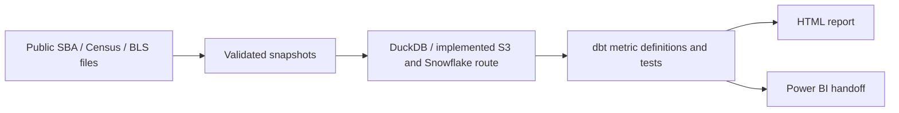

# Business lending, in context

Where is SBA loan approval activity concentrated, and how does the answer change
when we compare it with the local business base? I built a Python and SQL pipeline
that turns public agency files into validated snapshots, tested metrics and a
readable analysis.

**[Read the report →](https://stevennitesh.github.io/small-business-lending-pipeline/)**

Six charts, the findings, engineering decisions, definitions and downloadable
evidence. The report uses **2025 for lending** and **2023 for the employer-location
comparison**, from saved inputs checked on **October 5, 2026 UTC**.

**Main finding:** reported 2025 amounts rose **1.71% to $40.93 billion**, while
approval records fell from **81,081 to 74,098**. Dollar totals and record volume
tell different stories.

The population covers 50 states and Washington, DC. These are nominal SBA
7(a)/504 approvals, including canceled/not-funded records, rather than
disbursements or unique borrowers. Combined amounts add whole 7(a) loans and the
SBA/Certified Development Company portion of 504 loans. The analysis describes
activity and context; it does not establish credit access or causal impact.

## What I built

- Source adapters, immutable snapshots, validation and checksums for public SBA,
  Census business-location and BLS labor data.
- Python/Prefect orchestration, local DuckDB processing and an implemented
  S3/Snowflake route.
- dbt definitions and tests for record eligibility, comparable periods and
  additive metric components, plus reporting exports and a Power BI model handoff.
- Reproducible charts and an HTML report with exact aggregate values and provenance.

The agencies supply the data. DuckDB, dbt, Prefect and Power BI supply the
processing tools; I implemented their integration and the analysis contracts.



## Delivery status

The HTML report presents the current saved-data findings. The October local
rebuild passed **328 real-data dbt tests**; a later readiness check matched
**18 reporting CSVs / 253,942 rows** and checked **25 relationships**. The
[verification record](docs/images/lending_verification.json) separates those
recorded checks from chart generation.

Power BI Desktop correction is pending; paid live Snowflake execution is deferred.
The [handoff](powerbi/README.md) owns the remaining BI work. Publication evidence
is frozen at its stated check time; opening the report does not refresh sources.

## Reproduce and inspect

Use Linux/WSL, Python 3.12 and Make, or Docker. The lightweight gate uses no live
source downloads or cloud credentials:

```bash
make install PYTHON=python3.12
make ci-check
make portfolio-report
```

The HTML builder uses versioned public aggregates and charts. You can also
download and open the [offline report](reports/portfolio/index.html). Exact
regeneration of the underlying charts needs matching saved CSVs and readiness
evidence, which are excluded from Git. A new live refresh may include publisher
revisions and change historical figures.

[Methodology](docs/detailed/kpi_definitions.md) ·
[Architecture](docs/detailed/architecture.md) ·
[Verification](docs/detailed/testing_plan.md) ·
[Runtime and reproduction](docs/detailed/orchestration_runtime.md) ·
[Documentation map](docs/README.md)

Steven Bangdiwala
