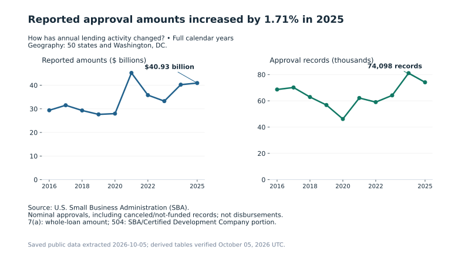
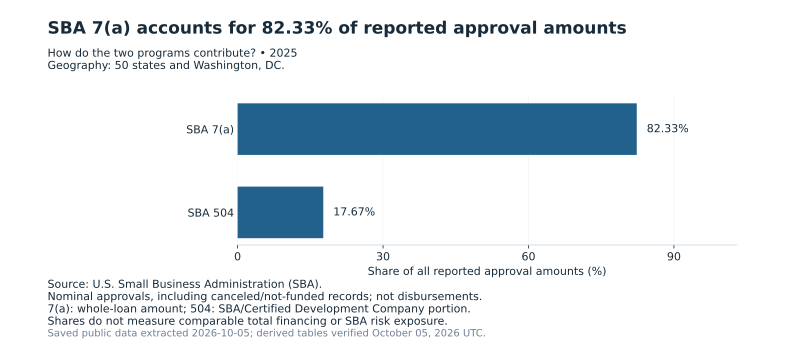
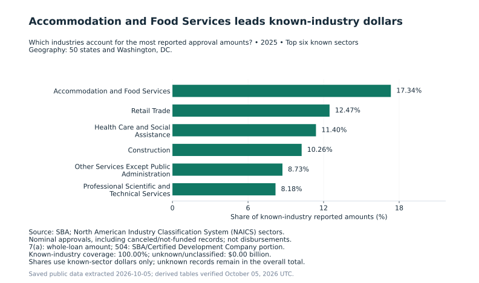
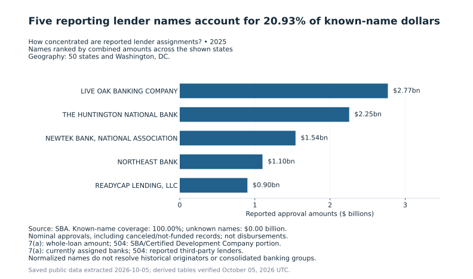
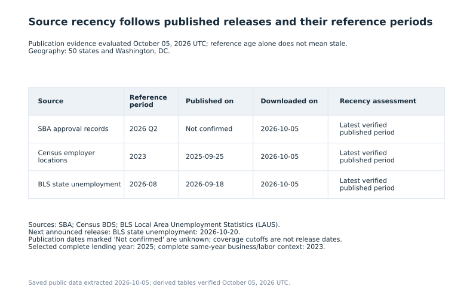

# SBA approval activity: results and source coverage

These charts and tables describe public SBA approval activity using validated source data.
Read the [case study](case_study.md) for interpretation and the [methodology](kpi_definitions.md) for definitions.
The [public verification record](../images/lending_verification.json) separates prior data validation from chart-generation checks.

SBA supports business lending through two programs: [7(a)](https://www.sba.gov/loans/7a-loans/)
covers general business uses such as working capital, equipment and real estate;
[504](https://www.sba.gov/loans/504-loans/) supports major fixed assets such as buildings and equipment.
Reported amounts use whole 7(a) loans plus the SBA/Certified Development Company portion of 504 loans.
The lending population covers **50 states and Washington, DC**: eligible records have a recognized project state and calendar approval date.
BLS labor data is validated for state-level Power BI context. These static charts focus on approvals, employer-location comparisons and source coverage.

## How much activity? — 2025

The U.S. Small Business Administration (SBA) records **$40.93 billion** in reported nominal approval amounts,
**74,098 approval records**. Reported approval amounts **increased by 1.71%** from 2024.
The average is **$552,334.00**, dividing dollars by **74,098 records with known amounts**.
These records include canceled/not-funded approvals; they are not unique borrowers or disbursements.

| Calendar year | Reported amounts | Approval records |
|---|---:|---:|
| 2016 | $29.39 billion | 68,625 |
| 2017 | $31.51 billion | 70,152 |
| 2018 | $29.30 billion | 62,895 |
| 2019 | $27.65 billion | 56,807 |
| 2020 | $27.98 billion | 46,167 |
| 2021 | $45.22 billion | 62,155 |
| 2022 | $35.81 billion | 59,021 |
| 2023 | $33.27 billion | 64,154 |
| 2024 | $40.24 billion | 81,081 |
| 2025 | $40.93 billion | 74,098 |

## Where is it concentrated? — 2023

Both rankings use the same calendar year. Employer establishments are business locations with employees,
across firm sizes; they are a contextual denominator rather than the number of eligible small businesses.

**Largest reported dollar totals**

| State | Reported amounts | Approval records |
|---|---:|---:|
| California | $5.06 billion | 7,660 |
| Texas | $3.26 billion | 4,540 |
| Florida | $2.88 billion | 5,451 |
| New York | $1.52 billion | 4,350 |
| Georgia | $1.36 billion | 1,895 |
| Illinois | $1.31 billion | 2,322 |

**Most approval records relative to employer locations**

| State | Reported amounts | Records per 1,000 employer locations |
|---|---:|---:|
| Ohio | $1.08 billion | 15.92 |
| Utah | $0.69 billion | 14.06 |
| New Hampshire | $0.13 billion | 13.43 |
| Michigan | $0.94 billion | 13.14 |
| Minnesota | $0.80 billion | 12.58 |
| Maine | $0.11 billion | 11.10 |

## What makes up the total? — 2025

7(a) reports whole loans; 504 reports the SBA/Certified Development Company portion.
Combined dollars therefore do not measure total project financing or comparable government exposure.

| Program | Reported amounts | Share of all amounts | Approval records |
|---|---:|---:|---:|
| SBA 7(a) | $33.70 billion | 82.33% | 67,933 |
| SBA 504 | $7.23 billion | 17.67% | 6,165 |

Known sectors cover **100.00%** of all reported amounts. Unknown/unclassified sectors contain
**$0.00 billion** and **0 records**.
Sector shares below divide by known-sector dollars, retaining unknown records in the overall total.

| Industry | Reported amounts | Share of known-industry amounts |
|---|---:|---:|
| Accommodation and Food Services | $7.10 billion | 17.34% |
| Retail Trade | $5.11 billion | 12.47% |
| Health Care and Social Assistance | $4.66 billion | 11.40% |
| Construction | $4.20 billion | 10.26% |
| Other Services Except Public Administration | $3.57 billion | 8.73% |
| Professional Scientific and Technical Services | $3.35 billion | 8.18% |

## How concentrated are lender assignments? — 2025

The five largest names account for **20.93%** of known-name dollars after
aggregation across the selected geography. This is different from combining each state's top five.
Known names cover **100.00%** of all dollars; unknown names account for
**$0.00 billion** and **0 records**.
7(a) uses currently assigned bank names; 504 uses reported third-party lender names. These normalized
names do not identify consolidated banking groups or resolve historical originators.

| Reporting lender name | Reported amounts | Share of known-name amounts |
|---|---:|---:|
| LIVE OAK BANKING COMPANY | $2.77 billion | 6.77% |
| THE HUNTINGTON NATIONAL BANK | $2.25 billion | 5.51% |
| NEWTEK BANK, NATIONAL ASSOCIATION | $1.54 billion | 3.76% |
| NORTHEAST BANK | $1.10 billion | 2.69% |
| READYCAP LENDING, LLC | $0.90 billion | 2.20% |

## How current is the evidence?

Download dates: **2026-10-05**. Publication and download checks were evaluated on
**2026-10-05 UTC**. Opening this report later does not update the evidence.
The six reporting files used by these charts match the files verified against modeled tables. Old reference periods alone do not mean stale data.

| Source | Latest verified published reference | Published on | Publisher checked on | Downloaded on | Recency assessment |
|---|---|---|---|---|---|
| [U.S. Small Business Administration (SBA) approval records](https://data.sba.gov/dataset/7a-504-foia) | 2026 Q2 | Not confirmed | 2026-10-05 | 2026-10-05 | Latest verified published period |
| [Census Business Dynamics Statistics (BDS): employer business locations](https://www.census.gov/programs-surveys/bds/news-updates/updates.html) | 2023 | 2025-09-25 | 2026-10-05 | 2026-10-05 | Latest verified published period |
| [Bureau of Labor Statistics (BLS), Local Area Unemployment Statistics (LAUS)](https://www.bls.gov/news.release/archives/laus_09182026.htm) | 2026-08 | 2026-09-18 | 2026-10-05 | 2026-10-05 | Latest verified published period |

| Source | Publication timing | Next announced release |
|---|---|---|
| U.S. Small Business Administration (SBA) approval records | Quarterly; typically one month after quarter end. | Not confirmed |
| Census Business Dynamics Statistics (BDS): employer business locations | Annual; typically September, about two years after the reference year. | Not confirmed |
| Bureau of Labor Statistics (BLS), Local Area Unemployment Statistics (LAUS) | Monthly; use the dated state release and its announced next release. | 2026-10-20 |

A passed schedule date triggers publisher verification, not an assumed new release.
Unknown publication dates stay unconfirmed; coverage cutoffs and catalog modification dates are not substitutes.
Only a verified newer published period makes saved data stale. Expired checks require verification instead.

The source endpoints above use separate clocks: SBA calendar approval dates, Census March 12 reference stocks,
and BLS month-end labor observations. October 2025 unemployment data was not published. The 2025 mean of 11 published months
is descriptive but does not support a comparable ordinary annual change.
Census BDS is released annually with a multi-year lag; the latest verified published year can have an old reference date.
The report uses 2025 for lending and 2023 for complete economic context.

## Reproduction and scope

Generated by `scripts/render_analysis_report.py` from checked local reporting CSVs.
The companion [aggregate JSON](../images/lending_analysis.json) records exact values and input CSV SHA256 hashes.
The [runtime guide](orchestration_runtime.md#reader-report-and-chart-generation) gives the repeatable generation command.
These are generated data charts, not Power BI screenshots. The manual Power BI report still needs Desktop correction;
paid Snowflake execution remains deferred. Chart generation itself performs no source refresh, warehouse rebuild or borrower-level publication.

Technical reference: frozen observation ages

Exact evaluation time: **2026-10-05 06:06:54.443163 UTC**. Ages are descriptive, not stale-data rules.

| Source | Latest saved observation/reference | Descriptive age at check (days) |
|---|---|---:|
| U.S. Small Business Administration (SBA) approval records | 2026-06-30 | 97 |
| Census Business Dynamics Statistics (BDS): employer business locations | 2023-03-12 | 1303 |
| Bureau of Labor Statistics (BLS), Local Area Unemployment Statistics (LAUS) | 2026-08-31 | 35 |

