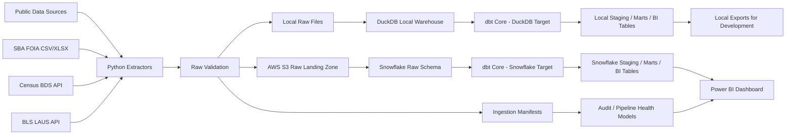

# Step 7: Pipeline Architecture

## Purpose

This section defines the technical architecture for the Small Business Lending Intelligence Pipeline.

The architecture connects the approved business scope, source inventory, KPI dictionary, and data model into an executable pipeline design. The goal is to show how public SBA, Census, and BLS data moves from source systems into raw storage, local development tables, Snowflake warehouse tables, dbt models, and Power BI dashboard outputs.

The MVP architecture is intentionally practical:

- Python handles extraction, file handling, validation, and loading support.
- AWS S3 acts as the raw data landing zone.
- DuckDB supports local-first development.
- Snowflake supports the final warehouse implementation.
- dbt Core owns SQL transformations and model documentation.
- Prefect orchestrates the end-to-end workflow.
- pytest validates Python logic.
- Power BI consumes modeled mart or BI tables.
- Docker standardizes the development/runtime environment.

Predictive machine learning, real-time processing, and unnecessary cloud infrastructure are out of scope.

---

## Architecture Goals

The pipeline architecture should satisfy the following goals.

1. **Reproducible ingestion**  
   Every source pull should create an immutable raw snapshot with a manifest, checksum, row count, schema metadata, and ingestion timestamp.

2. **Local-first development**  
   The pipeline should run locally with DuckDB before requiring Snowflake or full cloud configuration.

3. **Cloud-backed raw storage**  
   AWS S3 should store raw source files using a predictable, date-partitioned layout.

4. **Warehouse-ready transformations**  
   dbt models should run against DuckDB during development and Snowflake for the final version with equivalent logical schemas.

5. **Modeled dashboard outputs**  
   Power BI should connect to BI or mart tables, not raw files.

6. **Clear data quality gates**  
   The pipeline should stop or warn at defined checkpoints before publishing refreshed KPIs.

7. **Simple enough to finish**  
   The MVP should avoid AWS Glue, Lambda, Athena, Spark, Kubernetes, Terraform, and other infrastructure that would distract from the analytics-engineering signal.

---

## Architecture Overview



---

## End-to-End Data Flow

The full architecture follows this sequence.

```text
1. Start Prefect pipeline run
2. Load environment configuration
3. Resolve source resources and API parameters
4. Extract SBA, Census, and BLS data with Python requests/pandas
5. Write raw extracts to local storage or AWS S3 based on route
6. Run raw validation checks
7. Write ingestion manifests locally or to S3 based on route
8. Write validation results locally or to S3 based on route
9. Load raw extracts into DuckDB for local development or Snowflake for final warehouse
10. Run dbt seeds for reference data
11. Run dbt staging models
12. Run dbt intermediate models
13. Run dbt mart models
14. Run dbt BI-facing models
15. Run dbt tests and custom validation summaries
16. Publish final BI tables to Power BI
17. Record pipeline run status
```

---

## Runtime Modes

The project should support two runtime modes.

## Mode 1: Local Development Mode

Local mode is the first implementation path. It allows the full pipeline to be built and tested without depending on Snowflake or AWS setup.

```text
Public sources
    ↓
Python extractors
    ↓
local data/raw files
    ↓
DuckDB raw tables
    ↓
dbt-duckdb staging / marts / BI models
    ↓
CSV exports or local preview tables
```

### Local Mode Purpose

Local mode is used for:

- source profiling;
- extractor development;
- schema discovery;
- dbt model development;
- KPI logic validation;
- unit testing;
- dashboard prototyping;
- fast iteration before cloud setup.

### Local Mode Storage Layout

```text
data/
├── raw/
│   ├── sba/
│   ├── census/
│   └── bls/
│
├── manifests/
│   ├── sba/
│   ├── census/
│   └── bls/
│
├── validation/
│   ├── raw/
│   ├── staging/
│   └── marts/
│
├── warehouse/
│   └── small_business_lending.duckdb
│
└── exports/
    └── powerbi/
```

### Local Mode dbt Target

The local dbt target should use DuckDB.

```yaml
small_business_lending:
  target: dev_duckdb
  outputs:
    dev_duckdb:
      type: duckdb
      path: data/warehouse/small_business_lending.duckdb
      schema: main
```

The exact profile can be adjusted during implementation, but the local target should preserve the same logical layer names used by Snowflake:

```text
raw
staging
intermediate
marts
bi
audit
```

---

## Mode 2: Final Warehouse Mode

Cloud mode uses AWS S3 for durable pipeline artifacts and Snowflake for warehouse execution. The MVP still uses the local CLI/Prefect runner to orchestrate the run, so temporary runner files may exist during execution, but S3 and Snowflake are the durable cloud handoff.

```text
Public sources
    ↓
Python extractors
    ↓
AWS S3 raw payloads, manifests, and validation outputs
    ↓
Snowflake raw schema
    ↓
dbt-snowflake staging / marts / BI models
    ↓
Power BI dashboard
```

### Final Mode Purpose

Final mode is used to demonstrate:

- cloud object storage with S3;
- cloud-backed manifests, validation outputs, and reloadable raw payloads;
- warehouse loading into Snowflake;
- dbt transformations on a cloud warehouse;
- final dashboard consumption from modeled warehouse tables;
- recruiter-facing production-style architecture.

### Final Snowflake Layout

```text
SMALL_BUSINESS_LENDING
├── RAW
├── STAGING
├── INTERMEDIATE
├── MARTS
├── BI
└── AUDIT
```

### Final dbt Target

The final dbt target should use Snowflake.

```yaml
small_business_lending:
  target: prod_snowflake
  outputs:
    prod_snowflake:
      type: snowflake
      account: "{{ env_var('SNOWFLAKE_ACCOUNT') }}"
      user: "{{ env_var('SNOWFLAKE_USER') }}"
      password: "{{ env_var('SNOWFLAKE_PASSWORD') }}"
      role: "{{ env_var('SNOWFLAKE_ROLE') }}"
      database: "{{ env_var('SNOWFLAKE_DATABASE') }}"
      warehouse: "{{ env_var('SNOWFLAKE_WAREHOUSE') }}"
      schema: "{{ env_var('SNOWFLAKE_SCHEMA') }}"
      threads: 4
```

Use environment variables rather than hardcoded credentials.

---

## Source-to-Storage Architecture

## Source Extraction Layer

Python extractors should be source-specific. Each extractor should return a standardized extraction result object containing file paths, metadata, row counts, status, and validation messages.

Recommended modules:

```text
pipelines/extract/sba_extract.py
pipelines/extract/census_bds_extract.py
pipelines/extract/bls_laus_extract.py
```

### Extractor Responsibilities

| Responsibility | SBA | Census BDS | BLS LAUS |
|---|---:|---:|---:|
| Resolve source metadata | Yes | Optional | Optional |
| Build request/file URL | Yes | Yes | Yes |
| Call source endpoint or download file | Yes | Yes | Yes |
| Persist raw response | Yes | Yes | Yes |
| Capture source metadata | Yes | Yes | Yes |
| Generate row count | Yes | Yes | Yes |
| Generate checksum | Yes | Yes | Yes |
| Write manifest | Yes | Yes | Yes |

---

## Raw File Format Strategy

The raw layer should preserve source-native formats where practical.

| Source | Source Format | Raw Storage Format | Notes |
|---|---|---|---|
| SBA FOIA loan files | CSV | CSV | Preserve downloaded source file |
| SBA data dictionary | XLSX | XLSX | Preserve original dictionary file |
| Census BDS API | JSON | JSON | Preserve raw API response |
| BLS LAUS API | JSON | JSON | Preserve raw API response |
| Reference config | CSV/YAML | CSV/YAML | Version controlled when static |
| Ingestion manifests | JSON | JSON | Pipeline-generated metadata |
| Validation results | JSON/CSV | JSON/CSV | Used for audit models |

Optional normalized copies can be created for easier loading, but those should be treated as derived load artifacts, not the canonical raw source.

---

## AWS S3 Architecture

## S3 Role in the MVP

AWS S3 is the raw data landing zone. It stores immutable source snapshots and pipeline metadata.

S3 should not be used as a full data lakehouse for the MVP. It is the cloud-backed raw storage layer that supports lineage, reproducibility, and reloads into Snowflake.

---

## S3 Bucket Layout

Recommended bucket:

```text
s3://small-business-lending-pipeline/
```

Recommended prefixes:

```text
s3://small-business-lending-pipeline/
├── raw/
│   ├── sba/
│   │   ├── 7a_foia/
│   │   ├── 504_foia/
│   │   └── data_dictionary/
│   │
│   ├── census/
│   │   └── bds/
│   │
│   └── bls/
│       └── laus/
│
├── manifests/
│   ├── sba/
│   ├── census/
│   └── bls/
│
├── validation/
│   ├── raw/
│   ├── staging/
│   └── marts/
│
└── exports/
    └── powerbi/
```

---

## S3 Partitioning Pattern

Use source-specific prefixes and date partitions.

```text
raw/<source_system>/<dataset>/<resource_or_grain>/ingestion_date=YYYY-MM-DD/pipeline_run_id=<run_id>/<file>
```

Examples:

```text
raw/sba/7a_foia/source_period=fy2020_present/ingestion_date=2026-05-05/pipeline_run_id=abc123/foia_7a_fy2020_present.csv
raw/sba/504_foia/source_period=fy2010_present/ingestion_date=2026-05-05/pipeline_run_id=abc123/foia_504_fy2010_present.csv
raw/census/bds/grain=state_year/ingestion_date=2026-05-05/pipeline_run_id=abc123/bds_state_year.json
raw/bls/laus/grain=state_month/ingestion_date=2026-05-05/pipeline_run_id=abc123/laus_state_month.json
```

### S3 Design Rules

1. Do not overwrite raw objects.
2. Include `ingestion_date` in every raw path.
3. Include `pipeline_run_id` when practical.
4. Preserve source-native files.
5. Store manifests separately from raw data.
6. Store validation outputs separately from source files.
7. Avoid publishing borrower-level raw files as dashboard assets.

---

## Ingestion Manifest Architecture

Each extraction should produce a manifest file.

Manifest path pattern:

```text
manifests/<source_system>/ingestion_date=YYYY-MM-DD/pipeline_run_id=<run_id>/manifest.json
```

Recommended manifest fields:

| Field | Description |
|---|---|
| `pipeline_run_id` | Prefect run ID or generated UUID |
| `source_system` | `sba`, `census`, or `bls` |
| `source_dataset` | Source dataset name |
| `source_resource_name` | Source file/API query name |
| `source_url` | Source URL or API endpoint |
| `request_parameters` | API parameters or file metadata |
| `extracted_at_utc` | Extraction timestamp |
| `ingestion_date` | Date partition |
| `local_raw_path` | Local raw file path |
| `s3_raw_uri` | S3 object URI |
| `file_format` | CSV, JSON, XLSX, or YAML |
| `row_count` | Number of rows or observations |
| `column_count` | Number of columns where applicable |
| `file_size_bytes` | Raw file size |
| `sha256_checksum` | Raw file checksum |
| `schema_hash` | Hash of field names and inferred types |
| `validation_status` | `passed`, `warning`, or `failed` |
| `validation_messages` | Validation messages |

Manifests feed the `dim_source_file`, source freshness marts, and pipeline health dashboard.

Cloud manifest path pattern:

```text
manifests/<source_system>/<dataset_name>/<resource_name>/ingestion_date=YYYY-MM-DD/pipeline_run_id=<run_id>/<manifest-file>
```

Local runs keep manifests under `data/manifests/...`. Cloud runs write manifests to S3 and may keep local compatibility copies for the MVP runner. Run summaries record manifest artifact URIs and the durable validation result URI when cloud artifacts are present.

---

## DuckDB Architecture

DuckDB is the local warehouse engine for development.

## DuckDB Responsibilities

DuckDB should support:

- loading local raw files;
- profiling source data;
- running dbt models locally;
- validating KPI logic before Snowflake deployment;
- generating local preview exports;
- enabling fast development without cloud dependency.

## DuckDB Database Path

```text
data/warehouse/small_business_lending.duckdb
```

## DuckDB Logical Schemas

```text
raw
staging
intermediate
marts
bi
audit
```

## DuckDB Load Pattern

```text
local raw files
    ↓
Python load functions
    ↓
DuckDB raw tables
    ↓
dbt-duckdb models
    ↓
local mart and BI tables
```

## DuckDB Usage Rules

1. DuckDB is the first development target.
2. DuckDB schemas should mirror the Snowflake logical model.
3. dbt SQL should be written as portably as practical.
4. Warehouse-specific SQL should be isolated in macros when possible.
5. DuckDB outputs should not be treated as the final recruiter-facing warehouse if Snowflake is part of the completed project.

---

## Snowflake Architecture

Snowflake is the final warehouse target.

## Snowflake Responsibilities

Snowflake should support:

- raw table loading from S3-backed extracts;
- dbt staging, intermediate, mart, and BI schemas;
- final Power BI connectivity;
- persistent warehouse tables for recruiter-facing screenshots and demo queries;
- modeled KPI outputs.

## Snowflake Loading Strategy

The preferred final loading pattern is:

```text
S3 raw files
    ↓
Snowflake external stage or named stage
    ↓
COPY INTO raw tables
    ↓
dbt transformations
```

### MVP-acceptable fallback

If Snowflake stage setup slows implementation, the MVP can temporarily use Python-based loading into Snowflake raw tables after files are landed in S3.

Acceptable fallback:

```text
S3 raw files
    ↓
Python load process
    ↓
Snowflake raw tables
    ↓
dbt transformations
```

Final recruiter polish should still document S3 as the raw landing zone and Snowflake as the final warehouse.

## Snowflake Raw Loading Pattern

Recommended raw tables:

```text
RAW.RAW_SBA_7A_FOIA
RAW.RAW_SBA_504_FOIA
RAW.RAW_CENSUS_BDS_STATE_YEAR
RAW.RAW_BLS_LAUS_STATE_MONTH
RAW.RAW_INGESTION_MANIFEST
RAW.RAW_VALIDATION_RESULT
```

For CSV-based SBA files:

```sql
copy into RAW.RAW_SBA_7A_FOIA
from @RAW_STAGE/sba/7a_foia/
file_format = (type = csv field_optionally_enclosed_by = '"' skip_header = 1)
on_error = 'abort_statement';
```

For JSON-based API responses, either:

1. load raw JSON into variant-style landing tables and flatten in staging; or
2. normalize JSON to tabular CSV/Parquet load artifacts after preserving the original raw JSON.

MVP recommendation:

```text
Preserve raw JSON in S3, then create normalized tabular load artifacts for Snowflake raw tables.
```

This keeps the architecture practical while preserving source lineage.

---

## dbt Transformation Architecture

## dbt Role

dbt owns SQL transformation, documentation, testing, and lineage.

Python should not contain major KPI transformation logic. Python should extract, validate, and load. dbt should model business-ready tables.

## dbt Flow

```text
dbt seed
    ↓
dbt run --select staging
    ↓
dbt test --select staging
    ↓
dbt run --select intermediate
    ↓
dbt run --select marts
    ↓
dbt test --select marts
    ↓
dbt run --select bi
    ↓
dbt test --select bi
```

For simplicity, the MVP can run:

```bash
dbt build
```

The Prefect flow can later split the steps for better failure visibility.

---

## dbt Target Strategy

| Environment | dbt Target | Warehouse Engine | Use Case |
|---|---|---|---|
| Local dev | `dev_duckdb` | DuckDB | Fast local development |
| Final demo | `prod_snowflake` | Snowflake | Recruiter-facing final warehouse |
| CI optional | `ci_duckdb` | DuckDB | Lightweight tests in GitHub Actions |

## dbt Layer Mapping

| dbt Layer | Input | Output |
|---|---|---|
| Seeds | Static CSV reference files | State, NAICS, BLS series references |
| Sources | Raw DuckDB/Snowflake tables | Source definitions and freshness metadata |
| Staging | Raw tables | Clean source-specific models |
| Intermediate | Staging models | Reusable business logic |
| Marts | Intermediate/facts/dimensions | KPI-ready business tables |
| BI | Marts | Power BI-friendly tables |
| Audit | Manifests, validation, dbt results | Pipeline health marts |

---

## Latest-Snapshot Architecture Rule

Some source resources are cumulative or periodically refreshed. Raw S3 snapshots should be retained, but the active reporting model should avoid double-counting the same source records across ingestion dates.

Default reporting rule:

```text
Use the latest successful ingestion snapshot per source resource for current KPI marts.
```

Implementation pattern:

```text
raw_ingestion_manifest
    ↓
int_pipeline_latest_successful_sources
    ↓
staging models filter to latest successful source_file_key per resource
    ↓
current reporting marts
```

Historical raw snapshots remain useful for:

- row-count drift checks;
- schema drift checks;
- source correction detection;
- auditability;
- future snapshot comparison marts.

---

## Power BI Architecture

Power BI should consume only final mart or BI-layer tables.

## Final Power BI Path

```text
Snowflake BI schema
    ↓
Power BI dataset
    ↓
Dashboard pages
```

Recommended final connection:

```text
Power BI → Snowflake → BI schema tables
```

## Local Prototype Path

For early development, Power BI can use exported files from DuckDB BI tables.

```text
DuckDB BI tables
    ↓
CSV exports under data/exports/powerbi/
    ↓
Power BI prototype
```

This is useful before Snowflake is configured, but the final portfolio version should show Snowflake-backed Power BI if possible.

## Power BI Consumption Rules

1. Use `BI` schema tables by default.
2. Avoid connecting directly to raw tables.
3. Avoid borrower-level loan detail in dashboard visuals.
4. Keep Power BI measures thin; core KPI logic belongs in dbt.
5. Include a pipeline health page or data-quality section.
6. Document dashboard refresh assumptions.

---

## Pipeline Component Responsibilities

| Component | Responsibility | Should Not Do |
|---|---|---|
| Python extractors | API/file extraction, raw persistence, metadata capture | Complex KPI logic |
| S3 | Immutable raw storage and manifests | Transformations or BI logic |
| DuckDB | Local development warehouse | Replace final Snowflake demo if final target is available |
| Snowflake | Final warehouse and BI source | Store secrets in SQL scripts |
| dbt Core | Transformations, model docs, SQL tests, lineage | Source API calls |
| pytest | Unit tests for Python extractors, loaders, validators | Validate every SQL model |
| Prefect | Orchestration and task dependency control | Business transformation logic |
| Docker | Reproducible environment | Hide required setup documentation |
| Power BI | Visualization and stakeholder reporting | Define core KPI business logic |

---

## Configuration Architecture

## Environment Variables

Use `.env` locally and environment variables in runtime.

Example `.env.example`:

```bash
# Runtime
ENVIRONMENT=local
PIPELINE_NAME=small_business_lending_pipeline
LOCAL_DATA_DIR=data

# AWS
AWS_REGION=us-east-1
S3_BUCKET=small-business-lending-pipeline
S3_RAW_PREFIX=raw
S3_MANIFEST_PREFIX=manifests
S3_VALIDATION_PREFIX=validation

# Source API keys
CENSUS_API_KEY=
BLS_API_KEY=

# DuckDB
DUCKDB_PATH=data/warehouse/small_business_lending.duckdb

# Snowflake
SNOWFLAKE_ACCOUNT=
SNOWFLAKE_USER=
SNOWFLAKE_PASSWORD=
SNOWFLAKE_ROLE=
SNOWFLAKE_WAREHOUSE=
SNOWFLAKE_DATABASE=SMALL_BUSINESS_LENDING
SNOWFLAKE_SCHEMA=RAW

# dbt
DBT_TARGET=dev_duckdb
DBT_PROFILES_DIR=./dbt
```

Do not commit real credentials.

---

## Config Files

Recommended config files:

```text
config/
├── sources.yml
├── sba_resources.yml
├── census_bds_variables.yml
├── bls_laus_state_series.yml
├── freshness_rules.yml
└── raw_validation_expectations.yml
```

| Config File | Purpose |
|---|---|
| `sources.yml` | Source-level metadata and enabled flags |
| `sba_resources.yml` | Expected SBA resource names/patterns if dynamic discovery is not enough |
| `census_bds_variables.yml` | BDS variables requested from the Census API |
| `bls_laus_state_series.yml` | State-to-BLS-series mapping |
| `freshness_rules.yml` | Source freshness thresholds |
| `raw_validation_expectations.yml` | Active raw source payload expectations and value bounds |

---

## Repository Architecture

Recommended project structure:

```text
small-business-lending-pipeline/
├── README.md
├── docker-compose.yml
├── Dockerfile
├── .env.example
├── requirements.txt
├── pyproject.toml
│
├── config/
│   ├── sources.yml
│   ├── sba_resources.yml
│   ├── census_bds_variables.yml
│   ├── bls_laus_state_series.yml
│   ├── freshness_rules.yml
│   └── raw_validation_expectations.yml
│
├── docs/
│   ├── project_spec.md
│   ├── architecture.md
│   ├── data_source_inventory.md
│   ├── kpi_definitions.md
│   ├── data_model.md
│   ├── testing_plan.md
│   └── dashboard_spec.md
│
├── pipelines/
│   ├── flows/
│   │   └── lending_pipeline_flow.py
│   │
│   ├── extract/
│   │   ├── sba_extract.py
│   │   ├── census_bds_extract.py
│   │   └── bls_laus_extract.py
│   │
│   ├── load/
│   │   ├── duckdb_loader.py
│   │   ├── s3_loader.py
│   │   └── snowflake_loader.py
│   │
│   ├── validation/
│   │   ├── pipeline_health.py
│   │   ├── raw_manifest_artifact_validation.py
│   │   ├── raw_manifest_collection.py
│   │   ├── raw_manifest_rule_checks.py
│   │   ├── raw_payload_resources.py
│   │   ├── raw_validation_check_catalog.py
│   │   ├── raw_validation_expectations.py
│   │   ├── raw_validation_models.py
│   │   ├── raw_validation_output.py
│   │   ├── raw_validation_resources.py
│   │   ├── raw_validation_runner.py
│   │   ├── raw_validation_sources.py
│   │   ├── sba_payload_checks.py
│   │   ├── census_bds_payload_checks.py
│   │   ├── bls_laus_payload_checks.py
│   │   ├── validation_failures.py
│   │   ├── validation_result.py
│   │   └── validation_result_io.py
│   │
│   └── utils/
│       ├── hashing.py
│       ├── manifest.py
│       ├── dates.py
│       └── logging.py
│
├── dbt/
│   ├── models/
│   ├── seeds/
│   ├── macros/
│   ├── tests/
│   ├── dbt_project.yml
│   └── profiles.yml.example
│
├── tests/
│   ├── test_sba_extract.py
│   ├── test_census_bds_extract.py
│   ├── test_bls_laus_extract.py
│   ├── test_manifest.py
│   ├── test_raw_artifact_manifest_checks.py
│   └── test_loaders.py
│
├── data/
│   ├── raw/
│   ├── manifests/
│   ├── validation/
│   ├── warehouse/
│   └── exports/
│
├── powerbi/
│   ├── lending_dashboard.pbix
│   └── screenshots/
│
└── scripts/
    ├── run_local_pipeline.sh
    ├── run_dbt_local.sh
    └── export_powerbi_tables.py
```

`raw_validation_runner.py` coordinates the active raw gate. Validation result
schema, factories, JSON I/O, output persistence, source dispatch/expectations,
and blocking-failure enforcement live in ownership modules.
`pipelines/validation/pipeline_health.py` contains future pipeline-health row-count
and freshness helper checks for a later pipeline-health layer.

The `data/` directory should usually be excluded from Git except for placeholder `.gitkeep` files and small sample fixtures.

---

## Data Quality Gate Architecture

Detailed tests will be defined in Step 8, but the architecture should include the following gates.

```text
Extraction
    ↓
Raw file validation gate
    ↓
Raw load gate
    ↓
dbt staging test gate
    ↓
dbt mart test gate
    ↓
BI table validation gate
    ↓
Dashboard refresh eligibility
```

## Gate Behavior

| Gate | Example Checks | Failure Behavior |
|---|---|---|
| Raw file validation | File exists, row count, schema, checksum | Stop run for critical failure |
| Raw load | Table created, row count matches manifest | Stop run |
| Staging tests | not null, type, accepted values | Stop run for critical models |
| Mart tests | unique grain, non-negative metrics, valid ratios | Stop run before BI refresh |
| BI validation | expected tables exist, row count > 0 | Stop dashboard refresh/export |
| Freshness | latest source observation within expected window | Warn or fail based on severity |

---

## Failure and Retry Architecture

Detailed orchestration belongs in Step 9, but the architecture should define basic failure behavior.

| Failure Type | Example | Expected Behavior |
|---|---|---|
| Source request failure | API timeout | Retry with backoff |
| Source file missing | SBA resource unavailable | Fail source task |
| Schema drift | Expected column missing | Fail validation |
| Low row count | File has far fewer rows than expected | Warning or fail based on threshold |
| Load failure | Snowflake `COPY INTO` fails | Fail load task |
| dbt test failure | Duplicate state-year mart rows | Fail transformation task |
| Freshness warning | BDS latest year lags publication | Warning unless clearly stale |
| Power BI output missing | BI table not created | Fail publish/export task |

The project should distinguish between:

```text
source did not publish new data yet
```

and:

```text
pipeline failed to ingest or transform available data
```

---

## Local-to-Final Promotion Path

The project should be built in phases.

## Phase 1: Local Skeleton

```text
Create repository structure
Create .env.example
Create config files
Create DuckDB database path
Create dbt project skeleton
```

## Phase 2: Local Ingestion

```text
Build source extractors
Write local raw files
Generate manifests
Run raw validation checks
Load raw files into DuckDB
```

## Phase 3: Local dbt Modeling

```text
Create dbt seeds
Create staging models
Create intermediate models
Create mart models
Create BI models
Run dbt tests locally
```

## Phase 4: Local Dashboard Prototype

```text
Export BI tables from DuckDB
Build early Power BI prototype
Validate KPI logic visually
```

## Phase 5: AWS/Snowflake Promotion

```text
Create S3 bucket
Upload raw snapshots to S3
Create Snowflake database and schemas
Load raw tables into Snowflake
Run dbt with Snowflake target
Connect Power BI to Snowflake BI schema
```

## Phase 6: Recruiter Polish

```text
Add architecture diagram
Add dashboard screenshots
Add data quality screenshots
Update README
Document tradeoffs and limitations
```

---

## Security and Secrets Architecture

The MVP should use simple but responsible credential handling.

## Rules

1. Do not commit `.env`.
2. Commit `.env.example` only.
3. Do not hardcode API keys, AWS keys, or Snowflake credentials.
4. Use least-privilege S3 access where practical.
5. Do not expose raw borrower-level files through Power BI.
6. Do not publish private credentials in screenshots.
7. Do not include real Snowflake account identifiers in public documentation if not needed.

## IAM Scope for MVP

The AWS identity used by the pipeline only needs limited S3 permissions for the project bucket.

Minimum practical permissions:

```text
s3:PutObject
s3:GetObject
s3:ListBucket
```

Optional:

```text
s3:DeleteObject
```

Avoid delete permission unless needed for development cleanup.

---

## Architecture Non-Goals

The MVP architecture should not include:

- real-time streaming;
- AWS Glue;
- AWS Lambda;
- AWS Step Functions;
- AWS Athena;
- AWS Redshift;
- Spark or Databricks;
- Kubernetes;
- Terraform;
- production monitoring stacks;
- machine learning model training;
- borrower-level credit scoring;
- automated lending recommendations.

These are excluded to keep the project focused on analytics engineering execution.

---

## Architecture Acceptance Criteria

Step 7 is complete when the project has:

1. A documented end-to-end architecture from public sources to Power BI.
2. A clear local development mode using DuckDB.
3. A clear final warehouse mode using S3 and Snowflake.
4. A documented S3 raw landing structure.
5. A documented ingestion manifest pattern.
6. A documented source-to-storage flow.
7. A documented dbt transformation flow.
8. A documented Power BI consumption pattern.
9. Clear component responsibilities.
10. A recommended repository structure.
11. A clear local-to-final promotion path.
12. Explicit non-goals to avoid infrastructure scope creep.
13. Continued exclusion of predictive machine learning from the MVP.

---

## Step 7 Summary

The pipeline architecture uses a local-first, cloud-backed analytics engineering design. Python extracts SBA, Census, and BLS data, writes immutable raw snapshots and manifests, stores raw files locally and in AWS S3, loads the data into DuckDB for development or Snowflake for the final warehouse, transforms it with dbt into staging, intermediate, mart, and BI tables, and publishes Power BI dashboards from modeled outputs.

The architecture is intentionally scoped. S3 is used as the raw landing zone, DuckDB is used for local development, Snowflake is used for the final warehouse, and dbt owns transformation logic. The project avoids real-time processing, unnecessary AWS services, and predictive machine learning so the final deliverable stays focused, testable, and recruiter-readable.
