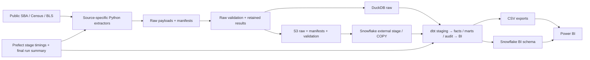

# Implemented architecture

Python/Prefect → immutable validated snapshots → DuckDB or S3/Snowflake → dbt
staging/facts/marts/BI → modeled Power BI sources and semantic measures.
This remains local-first, with the cloud promotion route supported.

## Owners and boundaries

| Owner | Responsibility |
|---|---|
| `pipelines/extract/` | Source discovery/API access and source-specific extraction |
| `pipelines/storage/` | Local/S3 artifact stores/readers; immutable raw custody |
| `pipelines/validation/` | Manifest, storage, payload and configured source acceptance |
| `pipelines/load/` | Validated local raw load; cloud S3 stage/COPY and metadata load |
| `dbt/models/` | Cleaning, eligible records, grains, joins, definitions and additive metric components |
| `config/` | Source settings, validation expectations, dated coverage and age policies |
| `pipelines/flows/` | Route setup, stage sequence/timing, failure reporting and final summary |
| `pipelines/powerbi/`, `powerbi/` | Modeled export contract, typed queries, relationships and small semantic measure layer |

The semantic layer follows [Power BI filter-responsive measures](https://learn.microsoft.com/en-us/power-bi/transform-model/desktop-measures).
It may sum components, divide sums, remove the appropriate category filter or
rank selected name totals. It cannot independently recreate source cleaning,
record eligibility or business definitions from raw records. Model validation
checks actual DAX definitions and references; it does not certify a manual PBIX.

## Local and cloud routes

Local raw data is loaded into DuckDB and dbt produces the stable BI tables exported
to `data/exports/powerbi/`. Cloud raw artifacts and manifests land on S3, then
Snowflake loads supported source files using an external stage/storage integration.
The cloud route retains validation and dbt artifacts on S3, creates required RAW,
STAGING, INTERMEDIATE, MARTS, BI and AUDIT schemas, and exposes the same logical BI
columns. It does not stage local data files directly into Snowflake as an alternate
loading route. Runtime credentials stay in environment configuration.

Both loaders require retained passing raw artifact and checksum checks matching
each selected manifest's run, source, resource, URI and checksum. An empty result
file or passing evidence for a different snapshot cannot authorize a load.
DuckDB rechecks local payload checksums before loading and replaces the four source
tables and their audit tables in one transaction. Duplicate selected manifests are
rejected. A source/count or metadata failure preserves the previous raw snapshot.
Local checksum inspection streams files rather than materializing full SBA CSVs.
Raw stores reject an existing local path or S3 key; standalone raw promotion also
uses conditional writes and the manifest's declared S3 key.

Snowflake maps each staged CSV's own header into the union of source columns and
loads only the exact manifest key with `FILES`, including its lineage in the COPY.
All four source tables and three audit tables are prepared as session temporary
candidates, with row-count reconciliation before publication. Existing tables and
any new nullable columns are prepared first; all seven row replacements then use
one explicit DML transaction, with rollback on failure. Existing grants and rows
survive failed publication; schema additions can persist. No DDL runs inside that
transaction because [Snowflake DDL commits independently](https://docs.snowflake.com/en/sql-reference/transactions).

After a successful dbt build, both routes copy `manifest.json` and
`run_results.json` to the run's validation directory before BI validation. The
final summary and cloud uploads use these retained copies; subsequent commands
may overwrite the shared `dbt/target` without replacing a retained run's evidence.
Local history keeps at most three pairs within 20 MiB per data root. Compact
receipts retain hashes, sizes and result counts when older pairs expire; run
summaries reference the receipt as well as the original artifact paths.
Both artifacts are required. Runtime paths and execution rules are in the
[runtime guide](orchestration_runtime.md).

Both routes inject the same policies from config into dbt. Adapter-compatible
macros handle dates, keys, division and source ages. Final completion happens after
dbt and BI validation/export, so same-pass BI completion is unknown; actual final
status comes from the run summary. Validity, source age and raw loading remain
independent labels. No service/scheduler is added.

Docker standardizes the Python 3.12/dbt runtime and runs `make ci-check`; it does
not add a second pipeline. There is no Glue, Spark, Kubernetes or extra deployment
infrastructure. [Runtime](orchestration_runtime.md) owns commands/environment;
[data model](data_model.md) owns schema/grain; [methodology](kpi_definitions.md)
owns comparison meaning.
