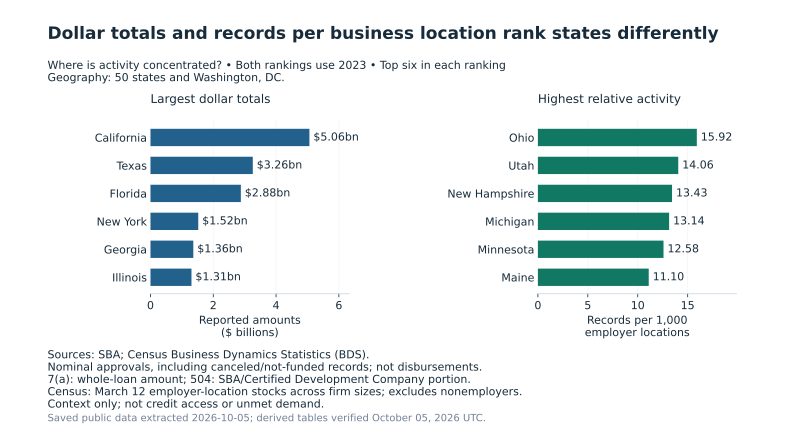

# Building a defensible SBA lending analysis

**The question:** where is SBA approval activity concentrated, and how does the
answer change when activity is compared with the local employer business base?

I built a local-first analytics pipeline and reproducible reporting layer using
public SBA 7(a)/504 approvals, Census Business Dynamics Statistics and BLS state
unemployment data. The work covers source adapters, snapshot validation,
Python/Prefect orchestration, dbt models and tests, reporting contracts, charts
and a Power BI handoff. The agencies provide the data; DuckDB, dbt, Prefect and
Power BI are the tools used to process and present it.

The current deliverable is the [six charts and results report](analysis_results.md).
Power BI Desktop delivery is pending; the outdated binary and screenshots have
been withdrawn from the public repository. The cloud route is implemented, with
paid live execution deferred.
This is a descriptive portfolio project, with no claimed business deployment or
causal impact.

## Engineering choices and proof

The central challenge was preserving the meaning of a comparison as public files
became modeled tables and charts. Three decisions illustrate that work.

### Define metric populations once, then aggregate components

An average of state-level average loan sizes can look plausible while producing
the wrong national result. dbt therefore owns eligibility and additive components:
reported dollars, approval records and records with known amounts. Reporting
divides summed dollars by the summed known-amount count. Zero remains known;
missing amounts remain in record volume but leave the average denominator.

The same principle governs concentration. Reporting lender names are combined
across the selected geography before ranking. Adding each state's top five would
mix different memberships and answer a different question. Industry shares use
known-sector dollars and disclose classification coverage beside the share.
Adversarial SQL tests use unequal groups and missing values to distinguish these
behaviors. The [methodology](kpi_definitions.md) owns the definitions;
[tests](testing_plan.md) and the [Power BI measures](../../powerbi/semantic_measures.dax)
make their implementation inspectable.

### Measure the whole workflow before retaining an optimization

A recorded May 2026 benchmark replaced a memory-heavy raw-load path with native
DuckDB CSV loading on the same retained source files. Wall time fell from
**28.6 to 18.069 seconds**; maximum resident memory fell from **about 4.7 GB to
2,002,464,768 bytes (about 2.0 GB)**. The four source-table row counts matched the
baseline, including **1,947,098 7(a) records and 227,404 504 records**.
The [benchmark record](design_decisions.md#native-duckdb-loading)
preserves the population, measurements and downstream checks. These are historical
observations, not a fresh benchmark of the current larger warehouse.

A separate trial persisted a broad intermediate loan table. It sped up the fact
model by about four seconds, but added a 14–15 second table build and hundreds of
megabytes to the warehouse. Both full and BI refreshes became slower, so the
change was rejected. The [decision record](design_decisions.md#rejected-intermediate-table)
explains why the simpler design was retained: measure end-to-end cost, not one
model in isolation.

### Treat period coverage and publication timing as part of the analysis

A new download does not guarantee a new observation year. The reporting layer
separates source reference periods, confirmed publication dates, download dates
and publisher checks. Census's 2023 employer-location reference was published
September 25, 2025 and remained the latest verified release at the October 5,
2026 check. It is not stale solely because its reference year is older.

The geographic comparison uses **2023 on both sides**; the lending overview uses
**2025**, its latest complete year. Census measures March 12 employer-location
stocks across firm sizes, while lending totals span calendar years. They give
context, without implying identical observation windows or a count of eligible
small businesses. BLS's omitted October 2025 observations remain unknown; its
11-month mean is descriptive and its ordinary comparable annual change is suppressed.
The [source inventory](data_source_inventory.md) explains these limits.

## What the resulting analysis shows

California led reported 2023 dollar volume at **$5.06 billion**. Ohio led approval
records per 1,000 employer business locations at **15.92**, followed by Utah and
New Hampshire. Large total activity and high activity relative to the business
base are different findings. Neither establishes credit access or unmet demand.

In 2025, reported amounts rose **1.71% to $40.93 billion**, while approval records
fell from **81,081 to 74,098**. The [results report](analysis_results.md) shows both
trends, program and industry shares, lender-name concentration and source coverage.
Amounts are nominal and include canceled/not-funded approvals. Records are not
unique borrowers or disbursements. Combined amounts add whole 7(a) loans and the
SBA/Certified Development Company portion of 504 loans, not total project financing.

## Presentation verification

The October local rebuild passed **328 real-data dbt tests** after rebuilding
**52 models and four seeds**. A later saved-data readiness check matched all
**253,942 rows in 18 reporting CSVs** to modeled tables and checked **25 relationships**.
Chart generation then checked the exact bytes of its six consumed inputs and
reconciled category amounts, record counts and known-amount counts.

The small [public verification record](../images/lending_verification.json)
separates recorded readiness from checks executed during chart generation and
provides hashes for the eight report outputs. Public text hashes normalize line
endings so Windows and Linux checkouts can be compared; source CSV hashes still
identify exact bytes. The [dated appendix](../implementation/lending_verification_history.md)
preserves earlier reconciliations and verification histories.
[CI results](https://github.com/stevennitesh/small-business-lending-pipeline/actions/workflows/ci.yml)
show checks for each published revision. Its runtime and source-contract checks
do not execute Desktop DAX, Power Query or current live Snowflake data.

The remaining BI deliverable is explicit: refresh the manual report, replace the
old measures, verify selections and capture the six required pages. The
[handoff](../../powerbi/README.md#correct-the-report-in-desktop) gives those steps;
the [screenshot status](../../powerbi/screenshots/README.md) explains what remains pending.

## Reproduce and inspect

The [runtime guide](orchestration_runtime.md#reader-report-and-chart-generation)
gives the chart command. It reads saved readiness-bound CSVs and publishes small
SVGs, aggregate JSON, the results report and its verification summary. It performs
no source download or warehouse rebuild. Exact values and input hashes are in the
[aggregate JSON](../images/lending_analysis.json).

For technical detail, use the [architecture](architecture.md),
[model grains](data_model.md), [field dictionary](data_dictionary.md), and
[verification scope](testing_plan.md). For a short overview, return to the
[project README](../../README.md).
