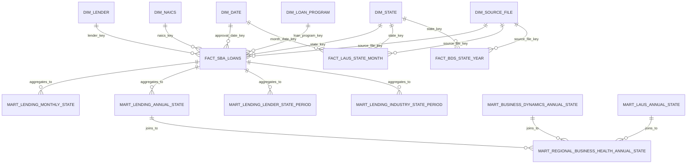

# Step 6: Data Model

## Purpose

This section defines the analytical data model for the Small Business Lending Intelligence Pipeline.

The model converts raw public SBA, Census, and BLS data into clean, tested, business-ready tables that can support Power BI reporting. The design follows the approved MVP scope:

- SBA 7(a) and 504 FOIA data as the core lending fact source.
- Census Business Dynamics Statistics as annual business-health context.
- BLS LAUS as monthly labor-market context.
- State-level analysis as the MVP geography.
- dbt models for staging, intermediate, mart, and BI-facing layers.
- No predictive machine learning in the MVP.

The model is designed to work locally in DuckDB first, then in Snowflake for the final version.

---

## Data Modeling Goals

The data model should satisfy six goals.

1. **Preserve raw source lineage**  
   Raw files must remain traceable through source file metadata, ingestion manifests, row hashes, and model lineage.

2. **Standardize source-specific structures**  
   SBA, Census, and BLS data arrive with different grains, field names, formats, and update patterns. Staging models normalize these differences.

3. **Support clean KPI calculation**  
   KPI logic should live in dbt mart or BI models, not in ad hoc Power BI calculations against raw files.

4. **Separate incompatible grains**  
   Monthly lending and labor-market metrics should not be casually mixed with annual Census business dynamics metrics. Cross-source tables must use compatible grains.

5. **Publish dashboard-ready outputs**  
   Power BI should connect to final mart or BI tables that are already shaped for reporting.

6. **Keep the MVP understandable**  
   The model should be complete enough to show analytics-engineering skill without becoming overly complex.

---

## Modeling Pattern

The project uses a layered warehouse pattern.

```text
S3 raw files
    ↓
raw schema
    ↓
staging models
    ↓
intermediate models
    ↓
mart models
    ↓
BI-facing models
    ↓
Power BI dashboard
```

| Layer | Purpose | Tooling | Example |
|---|---|---|---|
| Raw | Store source-shaped extracts and ingestion metadata | Python, S3, DuckDB, Snowflake | `raw_sba_7a_foia` |
| Staging | Clean names, types, dates, codes, and source-specific structures | dbt | `stg_sba_7a_loans` |
| Intermediate | Reusable business logic and enrichment | dbt | `int_sba_loans_enriched` |
| Mart | Business-ready fact, dimension, and aggregate tables | dbt | `mart_lending_monthly_state` |
| BI | Dashboard-specific tables optimized for Power BI | dbt | `bi_executive_overview` |
| Audit | Pipeline metadata, validation outputs, and freshness summaries | Python, dbt | `mart_pipeline_validation_summary` |

---

## Schema Design

The local DuckDB database and final Snowflake warehouse should use equivalent logical schemas.

| Schema | Purpose |
|---|---|
| `raw` | Source-shaped tables loaded from local files or S3 snapshots |
| `staging` | Cleaned source-specific models |
| `intermediate` | Reusable transformed models that support multiple marts |
| `marts` | Business-ready facts, dimensions, and KPI tables |
| `bi` | Power BI-facing tables with simplified shapes |
| `audit` | Ingestion manifests, validation results, dbt test summaries, and run metadata |

Recommended Snowflake database layout:

```text
SMALL_BUSINESS_LENDING
├── RAW
├── STAGING
├── INTERMEDIATE
├── MARTS
├── BI
└── AUDIT
```

Recommended DuckDB layout:

```text
data/warehouse/small_business_lending.duckdb
├── raw
├── staging
├── intermediate
├── marts
├── bi
└── audit
```

---

## Raw Layer Design

### Raw Layer Purpose

The raw layer stores source extracts as close to their original shape as practical. Raw models should not apply business logic. They should add only ingestion metadata required for traceability.

Raw files are retained as immutable snapshots in S3. The raw warehouse tables are loaded from those snapshots.

### Raw Layer Rules

1. Do not overwrite raw files.
2. Partition raw files by source and ingestion date.
3. Add ingestion metadata columns to every raw table.
4. Preserve original source columns where practical.
5. Do not publish raw tables to Power BI.
6. Do not calculate business KPIs in the raw layer.
7. Do not expose borrower-level raw records in dashboard outputs.

### Raw Source Tables

| Raw Table | Source | Grain | Description |
|---|---|---|---|
| `raw_sba_7a_foia` | SBA FOIA 7(a) files | Source loan record + source file | Raw 7(a) loan records across fiscal-year source files |
| `raw_sba_504_foia` | SBA FOIA 504 files | Source loan record + source file | Raw 504 loan records across fiscal-year source files |
| `raw_sba_data_dictionary` | SBA XLSX data dictionary | Source dictionary row | Source field definitions and notes |
| `raw_census_bds_state_year` | Census BDS API | State-year | Raw BDS state-year JSON normalized to rows |
| `raw_bls_laus_state_month` | BLS LAUS API | State-month-series | Raw LAUS monthly observations |
| `raw_ingestion_manifest` | Pipeline-generated metadata | Source extract | Metadata for each extraction |
| `raw_validation_result` | Pipeline-generated validation output | Validation check | Raw validation results by run/source/check |

### Common Raw Metadata Columns

Every raw table should include these fields where applicable.

| Column | Type | Description |
|---|---|---|
| `source_system` | text | Source identifier: `sba`, `census`, `bls`, or `pipeline` |
| `source_dataset` | text | Dataset identifier, such as `7a_504_foia`, `bds`, or `laus` |
| `source_resource_name` | text | Original source file or API query name |
| `source_file_name` | text | Downloaded file name, when applicable |
| `source_period` | text | Source period such as `fy2020_present`, where applicable |
| `source_row_number` | integer | Row number in the source file or normalized API response |
| `source_row_hash` | text | Hash of raw row values |
| `raw_file_uri` | text | Local path or S3 URI for the raw extract |
| `ingested_at_utc` | timestamp | Extraction timestamp |
| `ingestion_date` | date | Date partition used for raw storage |
| `pipeline_run_id` | text | Prefect run ID or generated UUID |

### Raw Snapshot Handling

Some public source files are cumulative or periodically refreshed. If the pipeline reads all raw snapshots at once, it can double-count records across ingestion dates.

The MVP model should use this rule:

```text
Use the latest successful ingestion snapshot per source resource for current KPI marts.
```

Historical raw snapshots remain available for audit and drift analysis, but the default reporting marts should use only the latest successful snapshot for each source resource.

Optional stretch behavior:

```text
Build historical snapshot comparison tables to detect row-count changes, schema drift, or metric drift across source refreshes.
```

---

## Staging Layer Design

### Staging Layer Purpose

The staging layer standardizes raw source data into clean, typed, source-specific models. Staging models should be thin and predictable.

Staging should handle:

- column renaming;
- type casting;
- date parsing;
- numeric parsing;
- state code standardization;
- NAICS cleanup;
- lender name cleanup;
- source metadata preservation;
- null and invalid value handling;
- latest-snapshot filtering where required.

### Staging Layer Rules

1. One staging model per raw source structure.
2. Use canonical field names from the KPI dictionary.
3. Keep source-specific models separate before unioning different programs.
4. Preserve source lineage fields.
5. Apply basic cleanup but avoid heavy aggregation.
6. Do not calculate final KPIs in staging.
7. Use dbt tests on staging keys, required fields, and accepted values.

### Staging Models

| Model | Source | Grain | Purpose |
|---|---|---|---|
| `stg_sba_7a_loans` | `raw_sba_7a_foia` | One cleaned 7(a) loan record | Standardize 7(a) source files |
| `stg_sba_504_loans` | `raw_sba_504_foia` | One cleaned 504 loan record | Standardize 504 source files |
| `stg_sba_loans` | 7(a) + 504 staging models | One cleaned SBA loan record | Normalized union across SBA programs |
| `stg_census_bds_state_year` | `raw_census_bds_state_year` | State-year | Standardize BDS fields and numeric indicators |
| `stg_bls_laus_state_month` | `raw_bls_laus_state_month` | State-month-measure | Standardize LAUS monthly observations |
| `stg_ingestion_manifest` | `raw_ingestion_manifest` | Source extract | Standardize source ingestion metadata |
| `stg_validation_result` | `raw_validation_result` | Validation check | Standardize validation results |
| `stg_ref_state` | dbt seed | State | Standardize state names, abbreviations, and FIPS codes |
| `stg_ref_naics` | dbt seed | NAICS code | Standardize NAICS sector and description mapping |
| `stg_ref_bls_laus_series` | local config / seed | BLS series | Map BLS LAUS series IDs to states and measures |

### SBA Staged Canonical Columns

`stg_sba_loans` should expose these canonical fields.

| Column | Type | Description |
|---|---|---|
| `loan_record_key` | text | Surrogate key for the staged loan record |
| `loan_program` | text | Normalized program value: `7a` or `504` |
| `approval_date` | date | Parsed approval date |
| `approval_month` | date | First day of approval month |
| `approval_quarter` | text/integer | Calendar quarter derived from approval date |
| `approval_year` | integer | Calendar year derived from approval date |
| `fiscal_year` | integer | Fiscal year where available or derived |
| `borrower_state_abbr` | text | Cleaned borrower state abbreviation |
| `borrower_state_fips` | text | Two-digit state FIPS derived from `stg_ref_state` |
| `borrower_city` | text | Borrower city, where available |
| `borrower_zip` | text | Borrower ZIP, where available |
| `standardized_lender_name` | text | Cleaned lender name |
| `lender_key` | text | Surrogate lender key |
| `naics_code` | text | Cleaned NAICS code |
| `naics_sector_code` | text | Two-digit NAICS sector |
| `gross_approval_amount` | numeric | Approved loan amount used for core volume KPIs |
| `sba_guaranteed_amount` | numeric | SBA guaranteed amount, if reliable |
| `jobs_supported` | numeric | Jobs supported/created/retained, if available and documented |
| `source_file_key` | text | Link to source file lineage |
| `source_row_hash` | text | Hash of raw row values |
| `ingestion_date` | date | Source ingestion date |
| `ingested_at_utc` | timestamp | Source ingestion timestamp |

### Census BDS Staged Canonical Columns

`stg_census_bds_state_year` should expose these fields.

| Column | Type | Description |
|---|---|---|
| `state_fips` | text | Two-digit state FIPS |
| `state_name` | text | State name from source or reference table |
| `calendar_year` | integer | BDS reference year |
| `establishment_count` | numeric | Number of establishments |
| `establishment_entry_count` | numeric | Establishment entries |
| `establishment_entry_rate` | numeric | Establishment entry rate |
| `establishment_exit_count` | numeric | Establishment exits |
| `establishment_exit_rate` | numeric | Establishment exit rate |
| `firm_count` | numeric | Number of firms |
| `job_creation_count` | numeric | Jobs created |
| `job_destruction_count` | numeric | Jobs destroyed |
| `source_file_key` | text | Link to source file lineage |
| `ingestion_date` | date | Source ingestion date |

### BLS LAUS Staged Canonical Columns

`stg_bls_laus_state_month` should expose these fields.

| Column | Type | Description |
|---|---|---|
| `state_fips` | text | Two-digit state FIPS from series mapping |
| `state_name` | text | State name from reference table |
| `series_id` | text | BLS LAUS series ID |
| `measure_name` | text | Measure name, such as `unemployment_rate` |
| `month_start_date` | date | First day of observation month |
| `calendar_year` | integer | Observation year |
| `month_number` | integer | Observation month |
| `measure_value` | numeric | Numeric value from BLS |
| `unemployment_rate` | numeric | Populated for unemployment-rate series |
| `footnotes` | variant/text | Source footnotes, if available |
| `source_file_key` | text | Link to source file lineage |
| `ingestion_date` | date | Source ingestion date |

---

## Intermediate Layer Design

### Intermediate Layer Purpose

Intermediate models hold reusable transformation logic that supports multiple marts. This keeps mart SQL readable and prevents duplicated business logic.

Intermediate models can:

- enrich staged rows with dimensions;
- create standardized base aggregations;
- calculate rankings and shares;
- prepare monthly and annual time grains;
- handle cross-source grain alignment;
- prepare pipeline metadata summaries.

### Intermediate Models

| Model | Grain | Purpose |
|---|---|---|
| `int_sba_loans_enriched` | One loan record | Join staged SBA loans to state, NAICS, lender, program, and date dimensions |
| `int_sba_lending_monthly_state_base` | State-month-program optional | Base monthly SBA lending aggregation |
| `int_sba_lending_annual_state_base` | State-year-program optional | Base annual SBA lending aggregation |
| `int_sba_lender_state_period` | State-period-lender | Lender amount, count, rank, and share calculations |
| `int_sba_industry_state_period` | State-period-NAICS sector | Industry amount, count, and share calculations |
| `int_sba_program_state_period` | State-period-program | Program mix calculations |
| `int_sba_lender_concentration` | State-period | Top lender share and optional HHI |
| `int_laus_monthly_state` | State-month | Pivot LAUS measure rows into unemployment-rate columns |
| `int_laus_annual_state` | State-year | Annual average unemployment-rate calculations |
| `int_bds_annual_state` | State-year | Clean BDS annual indicators and derived context metrics |
| `int_regional_context_annual_state` | State-year | Join annual lending, BDS, and annual LAUS context |
| `int_pipeline_latest_successful_sources` | Source resource | Latest successful source snapshot per resource |
| `int_pipeline_validation_summary` | Pipeline run / source / model | Validation and dbt test summary logic |

### Grain Alignment Rules

| Join | Allowed Grain | Notes |
|---|---|---|
| SBA lending + BLS LAUS | State-month | Valid for monthly lending/labor comparison |
| SBA lending + BLS LAUS | State-year | Use annual SBA totals and annual average unemployment rate |
| SBA lending + Census BDS | State-year | Valid because BDS is annual |
| SBA lending + Census BDS + BLS LAUS | State-year | Use annual lending, BDS indicators, and annual average unemployment rate |
| Census BDS + monthly dashboard visuals | Not allowed by default | Avoid repeating annual BDS values across months unless explicitly labeled |

---

## Mart Layer Design

### Mart Layer Purpose

The mart layer publishes business-ready facts, dimensions, and aggregate KPI tables. These are the primary tables used by Power BI and downstream analysis.

### Mart Layer Rules

1. Mart tables must have clear grains.
2. KPI calculations should be implemented in marts where possible.
3. Marts should be tested with dbt uniqueness and not-null tests.
4. Marts should not expose unnecessary raw borrower-level fields.
5. Marts should preserve source lineage keys where practical.
6. Mart names should clearly describe their grain.

---

# Core Dimensions

## `dim_date`

### Grain

```text
one row per calendar date
```

### Purpose

Supports daily, monthly, quarterly, annual, and fiscal-year reporting.

### Columns

| Column | Type | Description |
|---|---|---|
| `date_key` | integer | Date key in `YYYYMMDD` format |
| `date_day` | date | Calendar date |
| `month_start_date` | date | First day of month |
| `month_end_date` | date | Last day of month |
| `calendar_year` | integer | Calendar year |
| `calendar_quarter` | integer | Calendar quarter |
| `calendar_year_quarter` | text | Year-quarter label, such as `2026-Q1` |
| `month_number` | integer | Month number |
| `month_name` | text | Month name |
| `calendar_year_month` | text | Year-month label, such as `2026-05` |
| `fiscal_year` | integer | SBA fiscal year if needed |
| `is_month_start` | boolean | Month-start flag |
| `is_year_start` | boolean | Year-start flag |

### Primary Key

```text
date_key
```

---

## `dim_state`

### Grain

```text
one row per U.S. state or District of Columbia
```

### Purpose

Standardizes state names, abbreviations, and FIPS codes across SBA, Census, and BLS data.

### Columns

| Column | Type | Description |
|---|---|---|
| `state_key` | text | Surrogate key, usually `state_fips` |
| `state_fips` | text | Two-digit state FIPS |
| `state_abbr` | text | Two-character state abbreviation |
| `state_name` | text | Full state name |
| `census_region` | text | Census region |
| `census_division` | text | Census division |
| `is_state` | boolean | True for 50 states |
| `is_dc` | boolean | True for District of Columbia |
| `is_reporting_geography` | boolean | True when included in MVP dashboard |

### Primary Key

```text
state_key
```

---

## `dim_naics`

### Grain

```text
one row per NAICS code available in the reference seed
```

### Purpose

Standardizes industry reporting and supports sector-level dashboarding.

### Columns

| Column | Type | Description |
|---|---|---|
| `naics_key` | text | Surrogate key, usually cleaned NAICS code |
| `naics_code` | text | Cleaned NAICS code |
| `naics_sector_code` | text | Two-digit NAICS sector |
| `naics_sector_name` | text | NAICS sector label |
| `naics_description` | text | Industry description |
| `naics_level` | integer | Number of digits in the NAICS code |
| `is_unknown` | boolean | True for `Unknown / Unclassified` |

### Primary Key

```text
naics_key
```

### Required Default Row

The dimension should include an unknown row.

```text
naics_key = 'UNKNOWN'
naics_sector_name = 'Unknown / Unclassified'
```

---

## `dim_lender`

### Grain

```text
one row per standardized lender name
```

### Purpose

Supports lender ranking, lender share, and lender concentration analysis.

### Columns

| Column | Type | Description |
|---|---|---|
| `lender_key` | text | Hash or surrogate key derived from standardized lender name |
| `standardized_lender_name` | text | Cleaned lender name |
| `display_lender_name` | text | Dashboard-friendly lender label |
| `is_unknown_lender` | boolean | True when source lender name is missing |
| `first_seen_ingestion_date` | date | First ingestion date where lender appeared |
| `latest_seen_ingestion_date` | date | Latest ingestion date where lender appeared |

### Primary Key

```text
lender_key
```

### MVP Standardization Rules

The MVP should use basic lender cleanup only:

```text
trim whitespace
collapse repeated spaces
uppercase or title case consistently
remove obvious punctuation noise
map null or blank names to Unknown Lender
```

Deep lender entity resolution is a stretch goal.

---

## `dim_loan_program`

### Grain

```text
one row per SBA loan program
```

### Purpose

Standardizes SBA program values for 7(a) and 504 reporting.

### Columns

| Column | Type | Description |
|---|---|---|
| `loan_program_key` | text | Program key |
| `loan_program` | text | Normalized program value, such as `7a` or `504` |
| `loan_program_name` | text | Display name |
| `program_description` | text | Short description for documentation |
| `is_mvp_program` | boolean | True for programs included in MVP |

### Primary Key

```text
loan_program_key
```

---

## `dim_source_file`

### Grain

```text
one row per ingested source extract
```

### Purpose

Provides lineage from modeled records and KPIs back to raw source files or API responses.

### Columns

| Column | Type | Description |
|---|---|---|
| `source_file_key` | text | Surrogate key for source extract |
| `pipeline_run_id` | text | Prefect run ID or generated UUID |
| `source_system` | text | Source system |
| `source_dataset` | text | Dataset name |
| `source_resource_name` | text | Source file/API query name |
| `source_url` | text | Source URL or endpoint |
| `raw_file_uri` | text | S3 or local path |
| `file_format` | text | CSV, JSON, XLSX, YAML |
| `ingestion_date` | date | Ingestion partition date |
| `ingested_at_utc` | timestamp | Ingestion timestamp |
| `row_count` | integer | Raw row count |
| `column_count` | integer | Raw column count |
| `file_size_bytes` | integer | File size |
| `sha256_checksum` | text | Raw file checksum |
| `schema_hash` | text | Hash of schema metadata |
| `validation_status` | text | `passed`, `warning`, or `failed` |

### Primary Key

```text
source_file_key
```

---

# Core Fact Tables

## `fact_sba_loans`

### Grain

```text
one row per cleaned SBA loan record from the latest successful source snapshot
```

### Purpose

Detailed loan-level analytical fact table used to produce aggregated lending marts.

This table should not be connected directly to Power BI for the MVP dashboard unless needed for controlled drillthrough. Main dashboard pages should use aggregated marts.

### Columns

| Column | Type | Description |
|---|---|---|
| `loan_record_key` | text | Primary key for staged loan record |
| `source_file_key` | text | Link to source file lineage |
| `source_row_hash` | text | Raw row hash |
| `loan_program_key` | text | FK to `dim_loan_program` |
| `state_key` | text | FK to `dim_state` |
| `lender_key` | text | FK to `dim_lender` |
| `naics_key` | text | FK to `dim_naics` |
| `approval_date_key` | integer | FK to `dim_date` |
| `approval_date` | date | Approval date |
| `approval_month` | date | Approval month |
| `approval_year` | integer | Approval year |
| `gross_approval_amount` | numeric | Approved loan amount |
| `sba_guaranteed_amount` | numeric | SBA guaranteed amount, if reliable |
| `jobs_supported` | numeric | Jobs field, if available and documented |
| `is_valid_for_state_reporting` | boolean | True when state mapping is valid |
| `is_valid_for_amount_reporting` | boolean | True when loan amount is valid |
| `ingestion_date` | date | Source ingestion date |

### Primary Key

```text
loan_record_key
```

### Foreign Keys

| Column | References |
|---|---|
| `source_file_key` | `dim_source_file.source_file_key` |
| `loan_program_key` | `dim_loan_program.loan_program_key` |
| `state_key` | `dim_state.state_key` |
| `lender_key` | `dim_lender.lender_key` |
| `naics_key` | `dim_naics.naics_key` |
| `approval_date_key` | `dim_date.date_key` |

---

## `fact_laus_state_month`

### Grain

```text
one row per state per month per labor-market measure
```

### Purpose

Stores cleaned BLS LAUS labor-market observations.

### Columns

| Column | Type | Description |
|---|---|---|
| `laus_record_key` | text | Surrogate key for observation |
| `source_file_key` | text | Link to source file lineage |
| `state_key` | text | FK to `dim_state` |
| `month_date_key` | integer | FK to `dim_date` for month start |
| `month_start_date` | date | Observation month |
| `calendar_year` | integer | Observation year |
| `series_id` | text | BLS series ID |
| `measure_name` | text | Measure name |
| `measure_value` | numeric | Numeric measure value |
| `unemployment_rate` | numeric | Unemployment rate when measure applies |
| `footnotes` | text/variant | Source footnotes if available |
| `ingestion_date` | date | Source ingestion date |

### Primary Key

```text
laus_record_key
```

---

## `fact_bds_state_year`

### Grain

```text
one row per state per year
```

### Purpose

Stores cleaned Census BDS business dynamics indicators at the annual state grain.

### Columns

| Column | Type | Description |
|---|---|---|
| `bds_record_key` | text | Surrogate key for state-year BDS record |
| `source_file_key` | text | Link to source file lineage |
| `state_key` | text | FK to `dim_state` |
| `calendar_year` | integer | BDS reference year |
| `establishment_count` | numeric | Establishment count |
| `establishment_entry_count` | numeric | Establishment entries |
| `establishment_entry_rate` | numeric | Establishment entry rate |
| `establishment_exit_count` | numeric | Establishment exits |
| `establishment_exit_rate` | numeric | Establishment exit rate |
| `firm_count` | numeric | Firm count |
| `job_creation_count` | numeric | Jobs created |
| `job_destruction_count` | numeric | Jobs destroyed |
| `ingestion_date` | date | Source ingestion date |

### Primary Key

```text
bds_record_key
```

---

# Aggregate Mart Tables

## `mart_lending_monthly_state`

### Grain

```text
one row per state per month
```

### Purpose

Primary monthly state-level lending trend table.

### Columns

| Column | Type | Description |
|---|---|---|
| `state_key` | text | State key |
| `state_fips` | text | State FIPS |
| `state_abbr` | text | State abbreviation |
| `state_name` | text | State name |
| `month_start_date` | date | Reporting month |
| `calendar_year` | integer | Calendar year |
| `calendar_quarter` | integer | Calendar quarter |
| `total_approved_loan_amount` | numeric | Sum of approved SBA loan amount |
| `loan_count` | integer | Count of distinct loan records |
| `average_loan_size` | numeric | Approved amount divided by loan count |
| `approved_loan_amount_yoy_growth_pct` | numeric | Year-over-year approved amount growth |
| `loan_count_yoy_growth_pct` | numeric | Year-over-year loan count growth |
| `latest_source_ingestion_date` | date | Latest source ingestion date represented |

### Tests

| Test | Columns |
|---|---|
| Unique combination | `state_key`, `month_start_date` |
| Not null | `state_key`, `month_start_date`, `loan_count`, `total_approved_loan_amount` |
| Accepted range | `loan_count >= 0`, `total_approved_loan_amount >= 0` |

---

## `mart_lending_annual_state`

### Grain

```text
one row per state per calendar year
```

### Purpose

Annual state-level lending table used for Census BDS joins and annual executive reporting.

### Columns

| Column | Type | Description |
|---|---|---|
| `state_key` | text | State key |
| `state_fips` | text | State FIPS |
| `state_abbr` | text | State abbreviation |
| `state_name` | text | State name |
| `calendar_year` | integer | Reporting year |
| `total_approved_loan_amount` | numeric | Annual approved loan amount |
| `loan_count` | integer | Annual loan count |
| `average_loan_size` | numeric | Average approved loan size |
| `approved_loan_amount_yoy_growth_pct` | numeric | Annual year-over-year approved amount growth |
| `loan_count_yoy_growth_pct` | numeric | Annual year-over-year loan count growth |
| `latest_source_ingestion_date` | date | Latest source ingestion date represented |

### Tests

| Test | Columns |
|---|---|
| Unique combination | `state_key`, `calendar_year` |
| Not null | `state_key`, `calendar_year` |
| Accepted range | `loan_count >= 0`, `total_approved_loan_amount >= 0` |

---

## `mart_lending_lender_state_period`

### Grain

```text
one row per state per period per lender
```

Default MVP period:

```text
state + calendar_year + lender
```

Optional monthly version can be created later if needed.

### Purpose

Supports lender rankings, lender shares, and lender drilldowns.

### Columns

| Column | Type | Description |
|---|---|---|
| `state_key` | text | State key |
| `calendar_year` | integer | Reporting year |
| `lender_key` | text | Lender key |
| `standardized_lender_name` | text | Lender display name |
| `lender_approved_loan_amount` | numeric | Approved loan amount for lender |
| `lender_loan_count` | integer | Loan count for lender |
| `lender_average_loan_size` | numeric | Average loan size for lender |
| `lender_approved_amount_share` | numeric | Lender share of state-year approved dollars |
| `lender_rank_by_amount` | integer | Rank within state-year by approved amount |
| `lender_rank_by_loan_count` | integer | Rank within state-year by loan count |

### Tests

| Test | Columns |
|---|---|
| Unique combination | `state_key`, `calendar_year`, `lender_key` |
| Not null | `state_key`, `calendar_year`, `lender_key` |
| Accepted range | `lender_approved_loan_amount >= 0`, `lender_loan_count >= 0` |

---

## `mart_lending_concentration_state_period`

### Grain

```text
one row per state per period
```

Default MVP period:

```text
state + calendar_year
```

### Purpose

Supports lender concentration monitoring.

### Columns

| Column | Type | Description |
|---|---|---|
| `state_key` | text | State key |
| `calendar_year` | integer | Reporting year |
| `total_approved_loan_amount` | numeric | Total approved dollars in state-year |
| `loan_count` | integer | Total loan count in state-year |
| `active_lender_count` | integer | Number of lenders with activity |
| `top_1_lender_share` | numeric | Share from largest lender |
| `top_3_lender_share` | numeric | Share from top 3 lenders |
| `top_5_lender_share` | numeric | Share from top 5 lenders |
| `lender_hhi` | numeric | Optional Herfindahl-Hirschman Index |

### Tests

| Test | Columns |
|---|---|
| Unique combination | `state_key`, `calendar_year` |
| Not null | `state_key`, `calendar_year` |
| Accepted range | shares between `0` and `1`; `lender_hhi` between `0` and `10000` if implemented |

---

## `mart_lending_industry_state_period`

### Grain

```text
one row per state per period per NAICS sector
```

Default MVP period:

```text
state + calendar_year + naics_sector_code
```

### Purpose

Supports industry mix and industry trend reporting.

### Columns

| Column | Type | Description |
|---|---|---|
| `state_key` | text | State key |
| `calendar_year` | integer | Reporting year |
| `naics_sector_code` | text | Two-digit NAICS sector |
| `naics_sector_name` | text | NAICS sector label |
| `industry_approved_loan_amount` | numeric | Approved amount by industry |
| `industry_loan_count` | integer | Loan count by industry |
| `industry_average_loan_size` | numeric | Average loan size by industry |
| `industry_approved_amount_share` | numeric | Industry share of state-year approved amount |

### Tests

| Test | Columns |
|---|---|
| Unique combination | `state_key`, `calendar_year`, `naics_sector_code` |
| Not null | `state_key`, `calendar_year`, `naics_sector_code` |
| Accepted range | `industry_approved_loan_amount >= 0`, `industry_loan_count >= 0` |

---

## `mart_lending_program_state_period`

### Grain

```text
one row per state per period per SBA loan program
```

Default MVP period:

```text
state + calendar_year + loan_program
```

### Purpose

Supports 7(a) versus 504 program mix analysis.

### Columns

| Column | Type | Description |
|---|---|---|
| `state_key` | text | State key |
| `calendar_year` | integer | Reporting year |
| `loan_program` | text | SBA loan program |
| `program_approved_loan_amount` | numeric | Approved loan amount by program |
| `program_loan_count` | integer | Loan count by program |
| `program_average_loan_size` | numeric | Average loan size by program |
| `program_approved_amount_share` | numeric | Program share of state-year approved amount |

---

## `mart_laus_monthly_state`

### Grain

```text
one row per state per month
```

### Purpose

Publishes monthly state-level labor-market context for Power BI and lending comparison tables.

### Columns

| Column | Type | Description |
|---|---|---|
| `state_key` | text | State key |
| `state_fips` | text | State FIPS |
| `state_abbr` | text | State abbreviation |
| `state_name` | text | State name |
| `month_start_date` | date | Reporting month |
| `calendar_year` | integer | Calendar year |
| `unemployment_rate` | numeric | BLS LAUS unemployment rate |
| `unemployment_rate_yoy_change_pp` | numeric | YoY percentage-point change |
| `latest_source_ingestion_date` | date | Latest source ingestion date represented |

---

## `mart_laus_annual_state`

### Grain

```text
one row per state per calendar year
```

### Purpose

Publishes annual labor-market context for annual regional business-health analysis.

### Columns

| Column | Type | Description |
|---|---|---|
| `state_key` | text | State key |
| `calendar_year` | integer | Reporting year |
| `annual_average_unemployment_rate` | numeric | Average monthly unemployment rate |
| `annual_unemployment_rate_yoy_change_pp` | numeric | Year-over-year percentage-point change |
| `observed_month_count` | integer | Number of monthly observations included |
| `is_complete_year` | boolean | True when all 12 months are present |

---

## `mart_business_dynamics_annual_state`

### Grain

```text
one row per state per calendar year
```

### Purpose

Publishes Census BDS business dynamics context.

### Columns

| Column | Type | Description |
|---|---|---|
| `state_key` | text | State key |
| `state_fips` | text | State FIPS |
| `state_abbr` | text | State abbreviation |
| `state_name` | text | State name |
| `calendar_year` | integer | BDS reference year |
| `establishment_count` | numeric | Establishment count |
| `establishment_entry_count` | numeric | Establishment entries |
| `establishment_entry_rate` | numeric | Establishment entry rate |
| `establishment_exit_count` | numeric | Establishment exits |
| `establishment_exit_rate` | numeric | Establishment exit rate |
| `net_establishment_entry_count` | numeric | Entry count minus exit count |
| `firm_count` | numeric | Firm count |
| `job_creation_count` | numeric | Jobs created |
| `job_destruction_count` | numeric | Jobs destroyed |

---

## `mart_regional_business_health_annual_state`

### Grain

```text
one row per state per calendar year
```

### Purpose

Combines annual lending, Census BDS, and annual BLS LAUS indicators into a business-health context mart.

This is the primary cross-source table for regional comparison.

### Inputs

| Input Model | Grain |
|---|---|
| `mart_lending_annual_state` | State-year |
| `mart_business_dynamics_annual_state` | State-year |
| `mart_laus_annual_state` | State-year |

### Columns

| Column | Type | Description |
|---|---|---|
| `state_key` | text | State key |
| `state_fips` | text | State FIPS |
| `state_abbr` | text | State abbreviation |
| `state_name` | text | State name |
| `calendar_year` | integer | Reporting year |
| `total_approved_loan_amount` | numeric | Annual SBA approved amount |
| `loan_count` | integer | Annual SBA loan count |
| `average_loan_size` | numeric | Annual average loan size |
| `approved_loan_amount_yoy_growth_pct` | numeric | Annual lending growth |
| `loan_count_yoy_growth_pct` | numeric | Annual loan count growth |
| `establishment_count` | numeric | BDS establishment count |
| `establishment_entry_count` | numeric | BDS establishment entries |
| `establishment_entry_rate` | numeric | BDS entry rate |
| `establishment_exit_count` | numeric | BDS establishment exits |
| `establishment_exit_rate` | numeric | BDS exit rate |
| `annual_average_unemployment_rate` | numeric | Annual average unemployment rate |
| `loans_per_1000_establishments` | numeric | Loan count normalized by establishments |
| `approved_loan_dollars_per_establishment` | numeric | Approved dollars normalized by establishments |
| `lending_to_entry_ratio` | numeric | Optional loans per establishment entry |
| `has_bds_context` | boolean | True when BDS joined successfully |
| `has_laus_context` | boolean | True when LAUS annual context joined successfully |

### Tests

| Test | Columns |
|---|---|
| Unique combination | `state_key`, `calendar_year` |
| Not null | `state_key`, `calendar_year` |
| Accepted range | normalized metrics >= 0 when denominator exists |

---

# Pipeline and Audit Mart Tables

## `mart_pipeline_source_freshness`

### Grain

```text
one row per source dataset per pipeline run
```

### Purpose

Tracks whether source data is fresh enough for reporting.

### Columns

| Column | Type | Description |
|---|---|---|
| `pipeline_run_id` | text | Pipeline run ID |
| `source_system` | text | Source system |
| `source_dataset` | text | Dataset name |
| `latest_source_period` | text | Latest source period represented |
| `latest_source_observation_date` | date | Latest observation date in source |
| `latest_ingestion_date` | date | Latest ingestion date |
| `expected_freshness_days` | integer | Freshness threshold |
| `source_freshness_status` | text | `pass`, `warning`, or `fail` |
| `freshness_message` | text | Explanation |

---

## `mart_pipeline_validation_summary`

### Grain

```text
one row per pipeline run per source/model
```

### Purpose

Summarizes Python validation checks and dbt test results.

### Columns

| Column | Type | Description |
|---|---|---|
| `pipeline_run_id` | text | Pipeline run ID |
| `validation_scope` | text | `raw`, `staging`, `mart`, or `bi` |
| `source_or_model_name` | text | Source or dbt model name |
| `total_validation_checks` | integer | Total checks executed |
| `passed_validation_checks` | integer | Checks passed |
| `warning_validation_checks` | integer | Checks with warning |
| `failed_validation_checks` | integer | Checks failed |
| `validation_pass_rate` | numeric | Passed checks divided by total checks |
| `validation_status` | text | `pass`, `warning`, or `fail` |

---

## `mart_pipeline_run_summary`

### Grain

```text
one row per pipeline run
```

### Purpose

Provides run-level metadata for the Power BI pipeline health page.

### Columns

| Column | Type | Description |
|---|---|---|
| `pipeline_run_id` | text | Pipeline run ID |
| `run_started_at_utc` | timestamp | Run start timestamp |
| `run_completed_at_utc` | timestamp | Run completion timestamp |
| `run_status` | text | `success`, `warning`, or `failed` |
| `source_count` | integer | Number of sources attempted |
| `successful_source_count` | integer | Number of sources ingested successfully |
| `dbt_models_run` | integer | Number of dbt models executed |
| `dbt_tests_run` | integer | Number of dbt tests executed |
| `dbt_tests_failed` | integer | Number of dbt tests failed |
| `latest_successful_pipeline_run_at_utc` | timestamp | Latest successful run timestamp |

---

# BI Layer Design

## BI Layer Purpose

The BI layer should publish simplified tables for Power BI. These models reduce the need for complicated Power BI relationships and measures.

Power BI should use the BI layer by default.

### BI Layer Rules

1. Tables should be shaped for specific dashboard pages.
2. Columns should use dashboard-friendly names where appropriate.
3. Avoid raw source fields unless required for filters.
4. Avoid borrower-level detail in published dashboard tables.
5. Include only metrics and dimensions needed for visuals.
6. Keep relationships simple: usually dimensions connected to fact-like BI tables by state, date, lender, or industry keys.

---

## `bi_executive_overview`

### Grain

```text
one row per state per year
```

### Purpose

Supports the executive overview dashboard page.

### Source Models

- `mart_regional_business_health_annual_state`
- `mart_lending_concentration_state_period`

### Key Metrics

- `total_approved_loan_amount`
- `loan_count`
- `average_loan_size`
- `approved_loan_amount_yoy_growth_pct`
- `loan_count_yoy_growth_pct`
- `top_5_lender_share`
- `loans_per_1000_establishments`
- `annual_average_unemployment_rate`
- `establishment_entry_rate`

---

## `bi_state_lending_trends`

### Grain

```text
one row per state per month
```

### Purpose

Supports monthly state lending trend visuals and lending versus unemployment comparisons.

### Source Models

- `mart_lending_monthly_state`
- `mart_laus_monthly_state`

### Key Metrics

- `total_approved_loan_amount`
- `loan_count`
- `average_loan_size`
- `approved_loan_amount_yoy_growth_pct`
- `loan_count_yoy_growth_pct`
- `unemployment_rate`
- `unemployment_rate_yoy_change_pp`

---

## `bi_lender_concentration`

### Grain

```text
one row per state per year per lender
```

### Purpose

Supports lender ranking, lender share, and concentration drilldowns.

### Source Models

- `mart_lending_lender_state_period`
- `mart_lending_concentration_state_period`

### Key Metrics

- `lender_approved_loan_amount`
- `lender_loan_count`
- `lender_average_loan_size`
- `lender_approved_amount_share`
- `lender_rank_by_amount`
- `top_5_lender_share`
- `active_lender_count`

---

## `bi_industry_program_mix`

### Grain

```text
one row per state per year per NAICS sector per loan program
```

### Purpose

Supports industry and SBA program mix visuals.

### Source Models

- `mart_lending_industry_state_period`
- `mart_lending_program_state_period`

### Design Note

Industry and program may need to remain separate BI tables if combining them creates a misleading many-to-many grain. If program-by-industry analysis is required, build a dedicated mart from `fact_sba_loans` at this grain:

```text
state + calendar_year + naics_sector_code + loan_program
```

Recommended MVP approach:

```text
Keep industry mix and program mix as separate BI tables unless program-by-industry visuals are explicitly needed.
```

---

## `bi_regional_business_health`

### Grain

```text
one row per state per year
```

### Purpose

Supports state-level comparison of lending intensity, business formation, and labor-market context.

### Source Model

- `mart_regional_business_health_annual_state`

### Key Metrics

- `total_approved_loan_amount`
- `loan_count`
- `loans_per_1000_establishments`
- `approved_loan_dollars_per_establishment`
- `establishment_count`
- `establishment_entry_rate`
- `establishment_exit_rate`
- `annual_average_unemployment_rate`

---

## `bi_pipeline_health`

### Grain

```text
one row per source/model/check summary per pipeline run
```

### Purpose

Supports the data quality and pipeline health dashboard page.

### Source Models

- `mart_pipeline_source_freshness`
- `mart_pipeline_validation_summary`
- `mart_pipeline_run_summary`

### Key Metrics

- `source_row_count`
- `staged_row_count`
- `validation_pass_rate`
- `source_freshness_status`
- `latest_successful_pipeline_run_at_utc`
- `dbt_tests_failed`

---

# Entity Relationship Overview



---

# dbt Project Model Organization

Recommended dbt model structure:

```text
dbt/
├── models/
│   ├── sources/
│   │   └── sources.yml
│   │
│   ├── staging/
│   │   ├── sba/
│   │   │   ├── stg_sba_7a_loans.sql
│   │   │   ├── stg_sba_504_loans.sql
│   │   │   ├── stg_sba_loans.sql
│   │   │   └── _sba_models.yml
│   │   │
│   │   ├── census/
│   │   │   ├── stg_census_bds_state_year.sql
│   │   │   └── _census_models.yml
│   │   │
│   │   ├── bls/
│   │   │   ├── stg_bls_laus_state_month.sql
│   │   │   └── _bls_models.yml
│   │   │
│   │   ├── reference/
│   │   │   ├── stg_ref_state.sql
│   │   │   ├── stg_ref_naics.sql
│   │   │   ├── stg_ref_bls_laus_series.sql
│   │   │   └── _reference_models.yml
│   │   │
│   │   └── audit/
│   │       ├── stg_ingestion_manifest.sql
│   │       ├── stg_validation_result.sql
│   │       └── _audit_models.yml
│   │
│   ├── intermediate/
│   │   ├── int_sba_loans_enriched.sql
│   │   ├── int_sba_lending_monthly_state_base.sql
│   │   ├── int_sba_lending_annual_state_base.sql
│   │   ├── int_sba_lender_state_period.sql
│   │   ├── int_sba_lender_concentration.sql
│   │   ├── int_sba_industry_state_period.sql
│   │   ├── int_laus_monthly_state.sql
│   │   ├── int_laus_annual_state.sql
│   │   ├── int_bds_annual_state.sql
│   │   ├── int_regional_context_annual_state.sql
│   │   └── _intermediate_models.yml
│   │
│   ├── marts/
│   │   ├── dimensions/
│   │   │   ├── dim_date.sql
│   │   │   ├── dim_state.sql
│   │   │   ├── dim_naics.sql
│   │   │   ├── dim_lender.sql
│   │   │   ├── dim_loan_program.sql
│   │   │   ├── dim_source_file.sql
│   │   │   └── _dimension_models.yml
│   │   │
│   │   ├── facts/
│   │   │   ├── fact_sba_loans.sql
│   │   │   ├── fact_laus_state_month.sql
│   │   │   ├── fact_bds_state_year.sql
│   │   │   └── _fact_models.yml
│   │   │
│   │   ├── lending/
│   │   │   ├── mart_lending_monthly_state.sql
│   │   │   ├── mart_lending_annual_state.sql
│   │   │   ├── mart_lending_lender_state_period.sql
│   │   │   ├── mart_lending_concentration_state_period.sql
│   │   │   ├── mart_lending_industry_state_period.sql
│   │   │   ├── mart_lending_program_state_period.sql
│   │   │   └── _lending_models.yml
│   │   │
│   │   ├── context/
│   │   │   ├── mart_laus_monthly_state.sql
│   │   │   ├── mart_laus_annual_state.sql
│   │   │   ├── mart_business_dynamics_annual_state.sql
│   │   │   ├── mart_regional_business_health_annual_state.sql
│   │   │   └── _context_models.yml
│   │   │
│   │   └── pipeline/
│   │       ├── mart_pipeline_source_freshness.sql
│   │       ├── mart_pipeline_validation_summary.sql
│   │       ├── mart_pipeline_run_summary.sql
│   │       └── _pipeline_models.yml
│   │
│   └── bi/
│       ├── bi_executive_overview.sql
│       ├── bi_state_lending_trends.sql
│       ├── bi_lender_concentration.sql
│       ├── bi_industry_mix.sql
│       ├── bi_program_mix.sql
│       ├── bi_regional_business_health.sql
│       ├── bi_pipeline_health.sql
│       └── _bi_models.yml
│
├── seeds/
│   ├── ref_state.csv
│   ├── ref_naics.csv
│   └── ref_bls_laus_state_series.csv
│
├── macros/
│   ├── generate_surrogate_key.sql
│   ├── safe_divide.sql
│   ├── clean_lender_name.sql
│   └── date_spine.sql
│
└── dbt_project.yml
```

---

# Key Generation Strategy

## Surrogate Keys

Use deterministic hash-based surrogate keys so results are reproducible across DuckDB and Snowflake.

| Key | Suggested Inputs |
|---|---|
| `loan_record_key` | `source_system`, `loan_program`, `source_resource_name`, `source_row_hash` |
| `source_file_key` | `source_system`, `source_dataset`, `source_resource_name`, `ingestion_date`, `sha256_checksum` |
| `lender_key` | `standardized_lender_name` |
| `naics_key` | cleaned `naics_code`, or `UNKNOWN` |
| `state_key` | `state_fips` |
| `laus_record_key` | `series_id`, `state_fips`, `month_start_date`, `measure_name` |
| `bds_record_key` | `state_fips`, `calendar_year` |

### dbt Macro Pattern

```sql
{{ generate_surrogate_key([
    'source_system',
    'loan_program',
    'source_resource_name',
    'source_row_hash'
]) }} as loan_record_key
```

---

# Metric Calculation Placement

| Metric Type | Where It Should Be Calculated |
|---|---|
| Raw row count | Python validation / audit marts |
| Cleaned loan amount | Staging |
| Loan count | Mart models |
| Average loan size | Mart models |
| YoY growth | Mart models or BI layer if period-specific |
| Lender share | Mart models |
| Top 5 lender share | Concentration mart |
| Industry share | Industry mart |
| Loans per 1,000 establishments | Regional annual mart |
| Annual average unemployment rate | LAUS annual mart |
| Source freshness status | Pipeline freshness mart |
| Validation pass rate | Pipeline validation mart |

Rule:

```text
Power BI should mostly format and filter metrics, not define core business logic.
```

---

# Materialization Strategy

## DuckDB Local Development

| Layer | Recommended Materialization |
|---|---|
| Raw | Tables loaded from local files |
| Staging | Views or tables |
| Intermediate | Views |
| Marts | Tables |
| BI | Tables |
| Audit | Tables |

## Snowflake Final Version

| Layer | Recommended Materialization |
|---|---|
| Raw | Tables or external-stage-loaded tables |
| Staging | Views |
| Intermediate | Views or ephemeral models where appropriate |
| Marts | Tables or incremental tables |
| BI | Tables |
| Audit | Tables |

MVP recommendation:

```text
Use tables for marts and BI models. Use views for staging and intermediate models unless performance requires otherwise.
```

---

# Incremental and Refresh Strategy

## MVP Refresh Strategy

The MVP should use full-refresh dbt builds until the model is stable.

```bash
dbt build --full-refresh
```

This is acceptable for the portfolio MVP because the main goal is correctness, clarity, and reproducibility.

## Final Version Refresh Strategy

After the MVP is stable, selected marts can become incremental.

Good incremental candidates:

- `fact_sba_loans`
- `fact_laus_state_month`
- `fact_bds_state_year`
- `mart_lending_monthly_state`
- `mart_laus_monthly_state`

Avoid incremental complexity until tests and full-refresh builds are working.

---

# Data Privacy and Public Data Handling

The source data is public, but the model should still avoid unnecessary borrower-level exposure.

## Handling Rules

1. Store raw data as required for lineage and reproducibility.
2. Use detailed loan-level records only in internal facts and transformations.
3. Publish aggregated mart and BI tables to Power BI.
4. Avoid dashboard visuals that expose individual borrower records.
5. Document that metrics represent public SBA data and not private credit information.

---

# Model Contracts

Each dbt model should have a YAML definition with:

- model description;
- grain statement;
- column descriptions;
- primary key tests;
- not-null tests;
- accepted value tests where applicable;
- relationship tests for key dimensions;
- metric caveats where relevant.

Example model contract style:

```yaml
models:
  - name: mart_lending_annual_state
    description: >
      Annual state-level SBA lending metrics calculated from cleaned SBA FOIA loan records.
      Grain: one row per state per calendar year.
    columns:
      - name: state_key
        description: State key derived from two-digit state FIPS.
        tests:
          - not_null
          - relationships:
              to: ref('dim_state')
              field: state_key
      - name: calendar_year
        description: Calendar year derived from SBA loan approval date.
        tests:
          - not_null
      - name: total_approved_loan_amount
        description: Sum of SBA gross approved loan amount.
        tests:
          - not_null
      - name: loan_count
        description: Count of distinct staged SBA loan records.
        tests:
          - not_null
```

---

# Data Model Acceptance Criteria

Step 6 is complete when the project has:

1. A defined raw, staging, intermediate, mart, BI, and audit layer.
2. A documented grain for every major model.
3. A clear list of dimensions and facts.
4. A clear list of aggregate marts used for KPIs.
5. A cross-source annual regional business-health mart.
6. A monthly state lending and unemployment trend model.
7. A lender concentration mart.
8. An industry mix mart.
9. Pipeline health and validation mart tables.
10. A Power BI-facing BI layer.
11. Deterministic key-generation rules.
12. A latest-snapshot rule to prevent double-counting cumulative source files.
13. Clear separation between detailed loan facts and dashboard-ready aggregates.
14. A dbt project folder structure aligned to the model design.
15. Explicit confirmation that predictive ML is not part of the data model.

---

# Step 6 Summary

The data model uses a layered analytics-engineering design. Raw source files are retained in S3 and loaded into raw warehouse tables with ingestion metadata. dbt staging models standardize SBA, Census, and BLS data into canonical fields. Intermediate models apply reusable enrichment, aggregation, and cross-source grain alignment. Mart models publish business-ready facts, dimensions, and KPI tables. BI models simplify the final shape for Power BI.

The most important modeled outputs are:

- `fact_sba_loans`
- `mart_lending_monthly_state`
- `mart_lending_annual_state`
- `mart_lending_lender_state_period`
- `mart_lending_concentration_state_period`
- `mart_lending_industry_state_period`
- `mart_business_dynamics_annual_state`
- `mart_laus_monthly_state`
- `mart_laus_annual_state`
- `mart_regional_business_health_annual_state`
- `bi_executive_overview`
- `bi_state_lending_trends`
- `bi_lender_concentration`
- `bi_regional_business_health`
- `bi_pipeline_health`

This design keeps the MVP focused: trusted SQL/dbt models, clear KPI grains, tested transformations, traceable source lineage, and dashboard-ready tables without adding predictive machine learning or unnecessary infrastructure complexity.
