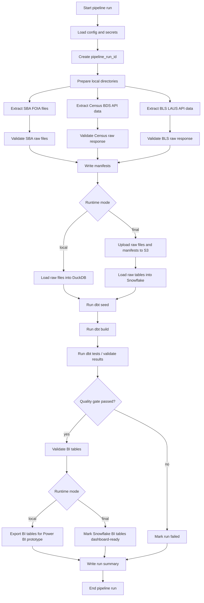

# Step 9: Orchestration and Runtime

## Purpose

This section defines how the Small Business Lending Intelligence Pipeline runs end to end.

The orchestration and runtime design turns the project architecture into an executable workflow. It specifies how Prefect coordinates extraction, validation, raw storage, warehouse loading, dbt transformations, testing, Power BI-ready outputs, and run-status reporting.

The MVP runtime is intentionally practical:

- run locally first with DuckDB;
- promote to S3 and Snowflake after local correctness is proven;
- use Prefect for task orchestration and failure visibility;
- use Docker to standardize the runtime environment;
- use dbt for SQL transformations and tests;
- use pytest for Python unit tests;
- publish Power BI from modeled BI or mart tables only;
- avoid unnecessary platform scope such as streaming, Glue, Lambda, Step Functions, Spark, Kubernetes, or ML model serving.

Predictive machine learning remains out of scope for the MVP.

---

## Runtime Design Goals

The runtime design should satisfy eight goals.

1. **Run end to end from a single command**  
   A reviewer should be able to run the local pipeline with a documented command.

2. **Support local and final warehouse modes**  
   Local mode uses DuckDB. Final mode uses S3 and Snowflake.

3. **Make failures visible**  
   Failed source pulls, validation errors, dbt test failures, and publishing failures should be visible in logs and pipeline status tables.

4. **Prevent bad data from reaching Power BI**  
   Required validation and dbt tests must pass before BI tables are considered refresh-ready.

5. **Preserve run metadata**  
   Each pipeline run should produce manifests, validation output, row counts, timestamps, statuses, and run summaries.

6. **Avoid hidden manual steps**  
   Manual steps should be limited to environment setup, credentials, and opening the Power BI file.

7. **Keep cloud usage focused**  
   AWS usage is limited to S3 raw storage. Snowflake is the final warehouse target.

8. **Remain recruiter-readable**  
   The runtime should be easy to explain from the README, architecture diagram, and sample commands.

---

## Runtime Modes

The project should support two runtime modes.

## Mode 1: Local Development Mode

Local mode is the required first implementation path.

```text
Public sources
    ↓
Python extractors
    ↓
local raw files
    ↓
raw validation
    ↓
DuckDB raw tables
    ↓
dbt-duckdb models
    ↓
dbt tests
    ↓
local BI tables / exports
```

### Local Mode Use Cases

Local mode is used for:

- extractor development;
- source profiling;
- schema discovery;
- dbt model development;
- KPI validation;
- pytest checks;
- Power BI prototyping from exported BI tables;
- fast iteration before S3 and Snowflake setup.

### Local Mode Output

```text
data/
├── raw/
├── manifests/
├── validation/
├── warehouse/
│   └── small_business_lending.duckdb
└── exports/
    └── powerbi/
```

---

## Mode 2: Final Warehouse Mode

Final mode demonstrates the full portfolio architecture.

```text
Public sources
    ↓
Python extractors
    ↓
local raw mirror
    ↓
raw validation
    ↓
AWS S3 raw landing zone
    ↓
Snowflake raw tables
    ↓
dbt-snowflake models
    ↓
dbt tests
    ↓
Snowflake BI schema
    ↓
Power BI dashboard
```

### Final Mode Use Cases

Final mode is used for:

- recruiter-facing architecture screenshots;
- Snowflake-backed modeled tables;
- Power BI connection to final BI tables;
- cloud raw storage demonstration;
- final README documentation.

### Final Mode Output

```text
AWS S3
├── raw/
├── manifests/
└── validation/

Snowflake
├── RAW
├── STAGING
├── INTERMEDIATE
├── MARTS
├── BI
└── AUDIT
```

---

## Orchestration Tool

Prefect is the orchestration layer for the MVP.

Prefect should coordinate task execution, dependencies, retries, logging, status handling, and scheduled refreshes. It should not contain business transformation logic. Python modules should handle extraction, validation, loading, and utility functions. dbt should handle SQL modeling, KPI calculations, tests, documentation, and lineage.

### Prefect Responsibilities

| Responsibility | Included in Prefect Flow |
|---|---:|
| Load runtime configuration | Yes |
| Generate pipeline run ID | Yes |
| Start and end run logging | Yes |
| Run source extractors | Yes |
| Run raw validation | Yes |
| Upload raw files to S3 | Yes, final mode |
| Load raw files into DuckDB | Yes, local mode |
| Load raw files into Snowflake | Yes, final mode |
| Run dbt seeds/models/tests | Yes |
| Enforce quality gates | Yes |
| Export local BI tables | Yes, local mode |
| Record pipeline run summary | Yes |
| Train ML models | No |
| Define KPI business logic | No |
| Replace dbt tests | No |
| Replace Power BI | No |

---

## High-Level Prefect Flow

Recommended flow name:

```text
small_business_lending_pipeline
```

Recommended flow file:

```text
pipelines/flows/lending_pipeline_flow.py
```

Recommended flow stages:

```text
1. Initialize run
2. Extract sources
3. Validate raw outputs
4. Persist raw data locally and/or to S3
5. Load warehouse raw tables
6. Run dbt transformations and tests
7. Validate BI outputs
8. Publish/export dashboard-ready tables
9. Record run summary
```

---

## Prefect Flow Diagram



---

## Flow Parameters

The Prefect flow should accept runtime parameters so the same flow can run in different modes.

| Parameter | Type | Default | Purpose |
|---|---|---|---|
| `run_mode` | string | `local` | `local` or `cloud` |
| `dbt_target` | string | `dev_duckdb` | dbt target profile |
| `ingestion_date` | date/string | current date | Raw partition date |
| `start_year` | integer | `2010` | Start year for Census/BLS extracts |
| `end_year` | integer | current year | End year for source extracts |
| `extract_sba` | boolean | `true` | Enable SBA extraction |
| `extract_census` | boolean | `true` | Enable Census extraction |
| `extract_bls` | boolean | `true` | Enable BLS extraction |
| `upload_to_s3` | boolean | based on mode | Upload raw outputs to S3 |
| `load_to_snowflake` | boolean | based on mode | Load raw outputs to Snowflake |
| `run_dbt` | boolean | `true` | Run dbt models/tests |
| `export_powerbi_tables` | boolean | `true` for local mode | Export BI tables locally |
| `fail_on_warning` | boolean | `false` | Treat warnings as failures when needed |

Example invocation:

```bash
python -m pipelines.flows.lending_pipeline_flow \
  --run-mode local \
  --dbt-target dev_duckdb \
  --start-year 2015 \
  --end-year 2026
```

---

## Recommended Task List

The Prefect flow should be composed of small, testable tasks.

| Task | Purpose | Critical Gate |
|---|---|---:|
| `load_runtime_config` | Read `.env`, YAML configs, and runtime parameters | Yes |
| `create_pipeline_run_id` | Generate run identifier used in paths and manifests | Yes |
| `prepare_local_directories` | Create local raw, manifest, validation, warehouse, and export directories | Yes |
| `extract_sba_foia` | Download SBA CSV/XLSX resources | Yes |
| `extract_census_bds` | Pull Census BDS state-year data | Yes |
| `extract_bls_laus` | Pull BLS LAUS state-month data | Yes |
| `validate_raw_sba` | Validate SBA files, schema, row counts, checksums | Yes |
| `validate_raw_census` | Validate Census API response | Yes |
| `validate_raw_bls` | Validate BLS API response | Yes |
| `write_ingestion_manifests` | Write manifest JSON files | Yes |
| `write_validation_results` | Persist validation outputs | Yes |
| `upload_raw_to_s3` | Upload raw files/manifests/validation to S3 | Final mode only |
| `load_raw_to_duckdb` | Load raw files into DuckDB raw schema | Local mode |
| `load_raw_to_snowflake` | Load raw files into Snowflake raw schema | Final mode |
| `run_pytest_smoke_checks` | Optional targeted runtime tests | Optional |
| `run_dbt_seed` | Load dbt seeds/reference data | Yes |
| `run_dbt_build` | Build staging, intermediate, mart, BI, and audit models | Yes |
| `collect_dbt_artifacts` | Capture dbt run/test artifacts | Yes |
| `validate_bi_tables` | Confirm BI models exist and have rows | Yes |
| `export_powerbi_tables` | Export local BI tables to CSV/Parquet | Local mode |
| `write_pipeline_run_summary` | Record run status and metrics | Yes |

---

## Task Dependency Rules

The flow should enforce these dependency rules.

1. **Configuration must load before extraction.**  
   No task should run if required config files or environment variables are missing.

2. **Raw validation must pass before loading.**  
   Invalid files or API responses should not be loaded into DuckDB or Snowflake.

3. **Manifests must be written before warehouse loading.**  
   Raw warehouse tables should be traceable to source files and pipeline runs.

4. **Warehouse raw tables must load before dbt runs.**  
   dbt sources depend on raw tables existing.

5. **dbt models must pass tests before BI publishing.**  
   BI outputs should not refresh from failed transformations.

6. **Run summary must execute even when the pipeline fails.**  
   Failed runs should still write enough metadata for debugging.

---

## Runtime Configuration

Configuration should be split across environment variables and version-controlled YAML files.

## Environment Variables

Use `.env` locally and runtime environment variables in Docker or scheduled execution.

Recommended `.env.example`:

```bash
# Runtime
ENVIRONMENT=local
PIPELINE_NAME=small_business_lending_pipeline
LOCAL_DATA_DIR=data
LOG_LEVEL=INFO

# AWS / S3
AWS_REGION=us-east-1
S3_BUCKET=small-business-lending-pipeline
S3_RAW_PREFIX=raw
S3_MANIFEST_PREFIX=manifests
S3_VALIDATION_PREFIX=validation

# Source API keys
CENSUS_API_KEY=
BLS_API_KEY=

# DuckDB
DUCKDB_PATH=data/warehouse/small_business_lending.duckdb

# Snowflake
SNOWFLAKE_ACCOUNT=
SNOWFLAKE_USER=
SNOWFLAKE_PASSWORD=
SNOWFLAKE_ROLE=
SNOWFLAKE_WAREHOUSE=
SNOWFLAKE_DATABASE=SMALL_BUSINESS_LENDING
SNOWFLAKE_SCHEMA=RAW

# dbt
DBT_TARGET=dev_duckdb
DBT_PROFILES_DIR=./dbt

# Power BI local exports
POWERBI_EXPORT_DIR=data/exports/powerbi
```

### Secret Handling Rules

1. Commit `.env.example`.
2. Do not commit `.env`.
3. Do not hardcode AWS, Snowflake, Census, or BLS credentials.
4. Do not print secrets in logs.
5. Do not include credentials or account identifiers in screenshots.
6. Use least-privilege S3 access where practical.

---

## YAML Config Files

Recommended config directory:

```text
config/
├── sources.yml
├── sba_resources.yml
├── census_bds_variables.yml
├── bls_laus_state_series.yml
├── freshness_rules.yml
└── raw_validation_expectations.yml
```

### `config/sources.yml`

Purpose: define enabled sources and high-level metadata.

```yaml
sources:
  sba_foia:
    enabled: true
    source_system: sba
    dataset_name: 7a_504_foia
    refresh_cadence: quarterly

  census_bds:
    enabled: true
    source_system: census
    dataset_name: bds
    refresh_cadence: annual

  bls_laus:
    enabled: true
    source_system: bls
    dataset_name: laus
    refresh_cadence: monthly
```

### `config/freshness_rules.yml`

Purpose: define source freshness thresholds.

```yaml
freshness_rules:
  sba_foia:
    expected_cadence: quarterly
    warning_after_days: 120
    fail_after_days: 210

  census_bds:
    expected_cadence: annual
    warning_after_days: 450
    fail_after_days: 730

  bls_laus:
    expected_cadence: monthly
    warning_after_days: 75
    fail_after_days: 120
```

These thresholds should be conservative because public datasets have publication lags and revisions.

### `config/raw_validation_expectations.yml`

Purpose: define active raw source payload expectations and value bounds.

```yaml
raw_validation_expectations:
  sba_foia:
    required_programs:
      - 7a
      - 504

  census_bds:
    expected_state_count: 51
    required_variables:
      - YEAR
      - state
      - ESTAB
      - ESTABS_ENTRY
      - ESTABS_EXIT

  bls_laus:
    required_period_pattern: '^M(0[1-9]|1[0-2])$'
    unemployment_rate_min: 0
    unemployment_rate_max: 100
```

---

## Scheduling Strategy

The MVP should support manual runs first, then scheduled runs.

## Manual Runs

Manual runs are required for development and recruiter demo reproducibility.

Recommended local command:

```bash
make run-local
```

Equivalent script:

```bash
bash scripts/run_local_pipeline.sh
```

Recommended cloud-mode command:

```bash
make run-cloud
```

Equivalent script:

```bash
bash scripts/run_cloud_pipeline.sh
```

## Scheduled Runs

After manual local and cloud runs work, create a Prefect schedule.

Recommended MVP schedule:

```text
Monthly refresh
```

Reasoning:

- BLS LAUS updates monthly.
- SBA FOIA is expected to refresh quarterly.
- Census BDS is annual.
- A monthly run keeps freshness checks active without overcomplicating source-specific schedules.

Optional later refinement:

| Source | Possible Schedule | MVP Recommendation |
|---|---|---|
| SBA FOIA | Quarterly | Keep inside monthly pipeline with freshness check |
| Census BDS | Annual | Keep inside monthly pipeline or run conditionally |
| BLS LAUS | Monthly | Run monthly |

The first version should avoid multiple independent schedules unless the single monthly schedule becomes inefficient.

---

## Retry Behavior

Retries should be used for transient failures only. They should not hide data quality problems.

| Task Type | Retry? | Recommended Behavior |
|---|---:|---|
| API request | Yes | Retry with exponential backoff |
| File download | Yes | Retry transient network failures |
| S3 upload | Yes | Retry transient upload failures |
| Snowflake load | Limited | Retry connection issues, not schema failures |
| Raw validation | No | Fail deterministically if validation fails |
| dbt build | No by default | Fix model/source issue instead of retrying blindly |
| dbt tests | No | Test failure should fail the run |
| Power BI export | Limited | Retry file write issues only |

Example policy:

```text
Source/API tasks: 3 retries
S3 upload tasks: 3 retries
Warehouse connection tasks: 2 retries
Validation/dbt test tasks: 0 retries
```

---

## Failure Behavior

The pipeline should distinguish critical failures from warnings.

## Critical Failures

A critical failure should stop the pipeline before publishing dashboard-ready outputs.

| Failure | Expected Behavior |
|---|---|
| Required config missing | Fail run |
| Required source unavailable after retries | Fail source task |
| Raw file missing | Fail run |
| Required columns missing | Fail validation |
| Raw file checksum cannot be generated | Fail validation |
| Warehouse raw load fails | Fail run |
| dbt build fails | Fail run |
| dbt tests fail on required models | Fail run |
| BI tables missing | Fail publish/export step |
| BI tables have zero rows | Fail publish/export step |

## Warnings

Warnings should be recorded but may allow the run to complete depending on severity.

| Warning | Expected Behavior |
|---|---|
| Public source has not published newer data yet | Warn and continue |
| Row count changes within acceptable threshold | Warn and continue |
| Non-critical optional field missing | Warn and continue |
| BDS latest year lags current calendar year | Warn and continue |
| Some BLS observations contain footnotes | Preserve footnotes and warn |
| Optional metric cannot be calculated | Exclude optional metric and warn |

## Failure Recording

Even when the pipeline fails, it should attempt to write:

```text
validation results
partial manifests where available
pipeline run summary
error messages
failed task name
run started/completed timestamps
```

This supports the `bi_pipeline_health` dashboard page and debugging.

---

## Quality Gates

The runtime should enforce quality gates at fixed checkpoints.

```text
Extract sources
    ↓
Raw validation gate
    ↓
Raw load gate
    ↓
dbt staging gate
    ↓
dbt mart gate
    ↓
BI validation gate
    ↓
Dashboard-ready outputs
```

## Gate 1: Raw Validation Gate

### Required Checks

- source file exists;
- API response is valid JSON where applicable;
- file size greater than zero;
- required resources, variables, or series IDs exist;
- manifest row count is captured;
- checksum generated;
- manifest written;
- validation result written.

### Failure Behavior

Critical raw validation failure stops the run before warehouse loading.

---

## Gate 2: Raw Load Gate

### Required Checks

- raw tables created;
- row count matches or reconciles to manifest;
- ingestion metadata fields populated;
- source file key populated;
- latest successful source snapshot identifiable.

### Failure Behavior

Raw load failure stops the run before dbt transformations.

---

## Gate 3: dbt Staging Gate

### Required Checks

- staging models build successfully;
- required columns are not null;
- accepted values pass;
- date parsing succeeds within threshold;
- numeric parsing succeeds within threshold;
- source lineage fields are preserved.

### Failure Behavior

Staging failure stops mart and BI builds.

---

## Gate 4: dbt Mart Gate

### Required Checks

- mart model grains are unique;
- required keys are not null;
- amounts and counts are non-negative;
- ratios are within valid ranges;
- cross-source annual joins do not duplicate state-year rows;
- latest-snapshot rule is enforced.

### Failure Behavior

Mart failure stops BI publishing.

---

## Gate 5: BI Validation Gate

### Required Checks

- BI tables exist;
- BI tables have rows;
- required KPI columns exist;
- no borrower-level raw fields are exposed;
- latest successful pipeline run is recorded;
- source freshness and validation status are available.

### Failure Behavior

BI validation failure prevents local export or dashboard refresh eligibility.

---

## Idempotency and Rerun Rules

The pipeline should be safe to rerun.

## Raw File Rule

Raw files should be immutable.

```text
Do not overwrite raw source files.
```

Use partitioned paths:

```text
raw/<source>/<dataset>/<resource>/ingestion_date=YYYY-MM-DD/pipeline_run_id=<run_id>/<file>
```

## Warehouse Reporting Rule

Current reporting marts should use:

```text
latest successful ingestion snapshot per source resource
```

This prevents double-counting cumulative or refreshed public files.

## Rerun Behavior

| Scenario | Expected Behavior |
|---|---|
| Rerun same day with same source files | Create new run ID and manifest; latest successful snapshot logic controls reporting |
| Previous run failed before warehouse load | New run can proceed without manual cleanup |
| Previous run failed after raw files landed | New run writes new artifacts and validates independently |
| dbt full-refresh rerun | Rebuild modeled tables from latest successful source snapshots |
| S3 upload duplicate path conflict | Avoid by including `pipeline_run_id` in path |

---

## Docker Runtime

Docker should standardize the Python/dbt runtime.

The MVP does not need a complex multi-service platform. A simple containerized runtime is enough.

## Docker Responsibilities

Docker should provide:

- Python runtime;
- project dependencies;
- dbt adapters;
- Prefect runtime;
- DuckDB local execution support;
- consistent CLI scripts;
- reproducible local environment.

Docker should not hide project logic or replace documentation.

---

## Recommended `Dockerfile`

```dockerfile
FROM python:3.11-slim

ENV PYTHONDONTWRITEBYTECODE=1
ENV PYTHONUNBUFFERED=1
ENV PIP_NO_CACHE_DIR=1

WORKDIR /app

RUN apt-get update \
    && apt-get install -y --no-install-recommends make \
    && rm -rf /var/lib/apt/lists/*

COPY Makefile requirements.txt .
RUN make install

COPY . .

CMD ["make", "test"]
```

---

## Recommended `docker-compose.yml`

```yaml
services:
  pipeline:
    build: .
    container_name: small_business_lending_pipeline
    env_file:
      - .env.example
    working_dir: /app
    command: make test
```

The default Compose service runs the image snapshot instead of bind-mounting the
repo. That keeps the image-created `.venv` available inside `/app` and makes a
fresh-clone `docker compose up` path reproducible. Use a local override file for
interactive bind-mounted development if needed.

Optional local Prefect UI can be added later, but it is not required for the MVP.

---

## Python Dependencies

Recommended `requirements.txt` categories:

```text
# Core
requests
pandas
pyyaml
python-dotenv

# Storage / warehouse
boto3
duckdb
snowflake-connector-python

# dbt
dbt-core
dbt-duckdb
dbt-snowflake

# Orchestration
prefect

# Testing
pytest

# Optional utilities
rich
```

Pin versions once implementation begins and the environment is stable.

---

## Local Run Commands

Use `make` or shell scripts to make the project easy to run.

## Current `Makefile` Interface

```makefile
.PHONY: install test run-local run-local-fixture run-local-live run-cloud dbt-local dbt-build-local-fast dbt-build-local-full powerbi-refresh-local cleanup-local-data-dry-run cleanup-local-data

install:
	$(PYTHON) -m venv $(VENV)
	$(VENV_PIP) install -r requirements.txt

test:
	$(VENV_PYTHON) -m pytest

run-local: run-local-fixture

run-local-fixture:
	scripts/run_local_pipeline.sh --extract-mode fixture

run-local-live:
	scripts/run_local_pipeline.sh --extract-mode live

run-cloud:
	scripts/run_cloud_pipeline.sh

dbt-local:
	scripts/run_dbt_local.sh compile

dbt-build-local-fast:
	scripts/run_dbt_local.sh seed
	scripts/run_dbt_local.sh run
	scripts/run_dbt_local.sh test --select tag:critical

dbt-build-local-full:
	scripts/run_dbt_local.sh build

cleanup-local-data-dry-run:
	$(VENV_PYTHON) scripts/cleanup_local_data.py --dry-run
```

## Recommended Script Files

```text
scripts/
├── run_local_pipeline.sh
├── run_cloud_pipeline.sh
├── run_dbt_local.sh
├── export_powerbi_tables.py
├── validate_powerbi_model.py
├── benchmark_local_command.py
├── cleanup_local_data.py
└── repo_bootstrap.py
```

---

## Local Pipeline Script

Recommended `scripts/run_local_pipeline.sh`:

```bash
#!/usr/bin/env bash
set -euo pipefail

export ENVIRONMENT=local
export DBT_TARGET=dev_duckdb

python -m pipelines.flows.lending_pipeline_flow \
  --run-mode local \
  --dbt-target dev_duckdb
```

---

## Cloud Pipeline Script

Recommended `scripts/run_cloud_pipeline.sh`:

```bash
#!/usr/bin/env bash
set -euo pipefail

export ENVIRONMENT=cloud
export DBT_TARGET=prod_snowflake

python -m pipelines.flows.lending_pipeline_flow \
  --run-mode cloud \
  --dbt-target prod_snowflake
```

---

## Prefect Flow Pseudocode

The actual implementation can change, but the flow should resemble this structure.

```python
from prefect import flow, task


@flow(name="small_business_lending_pipeline")
def lending_pipeline_flow(
    run_mode: str = "local",
    dbt_target: str = "dev_duckdb",
    start_year: int = 2010,
    end_year: int | None = None,
    extract_sba: bool = True,
    extract_census: bool = True,
    extract_bls: bool = True,
    fail_on_warning: bool = False,
) -> None:
    config = load_runtime_config(run_mode=run_mode, dbt_target=dbt_target)
    pipeline_run_id = create_pipeline_run_id()
    prepare_local_directories(config)

    extraction_results = []

    if extract_sba:
        sba_result = extract_sba_foia(config, pipeline_run_id)
        validate_raw_sba(sba_result, config, fail_on_warning)
        extraction_results.append(sba_result)

    if extract_census:
        census_result = extract_census_bds(config, pipeline_run_id, start_year, end_year)
        validate_raw_census(census_result, config, fail_on_warning)
        extraction_results.append(census_result)

    if extract_bls:
        bls_result = extract_bls_laus(config, pipeline_run_id, start_year, end_year)
        validate_raw_bls(bls_result, config, fail_on_warning)
        extraction_results.append(bls_result)

    write_ingestion_manifests(extraction_results, config, pipeline_run_id)
    write_validation_results(extraction_results, config, pipeline_run_id)

    if run_mode == "cloud":
        upload_raw_to_s3(extraction_results, config)
        load_raw_to_snowflake(extraction_results, config)
    else:
        load_raw_to_duckdb(extraction_results, config)

    run_dbt_seed(config, dbt_target)
    dbt_result = run_dbt_build(config, dbt_target)
    collect_dbt_artifacts(dbt_result, config, pipeline_run_id)

    validate_bi_tables(config, dbt_target)

    if run_mode == "local":
        export_powerbi_tables(config)

    write_pipeline_run_summary(config, pipeline_run_id, status="success")
```

Production-quality implementation should use `try` / `finally` or Prefect state handling so failed runs still write a run summary where practical.

---

## dbt Runtime Strategy

The Prefect flow should call dbt through subprocess commands or a thin wrapper utility.

## MVP dbt Command

Use the lightweight local compile target for routine verification.

```bash
make dbt-local
```

Use the full local build only when the heavier DuckDB run is intentional:

```bash
make dbt-build-local-full
```

Cloud mode runs through the pipeline wrapper so the dbt target and artifact
handoff stay aligned:

```bash
make run-cloud
```

## Optional Split dbt Commands

If more failure visibility is needed, split dbt into stages:

```bash
scripts/run_dbt_local.sh seed
scripts/run_dbt_local.sh run --select staging
scripts/run_dbt_local.sh test --select staging
scripts/run_dbt_local.sh run --select intermediate
scripts/run_dbt_local.sh run --select marts
scripts/run_dbt_local.sh test --select marts
scripts/run_dbt_local.sh run --select bi
scripts/run_dbt_local.sh test --select bi
```

MVP recommendation:

```text
Start with dbt build. Split later only if debugging requires it.
```

---

## dbt Artifact Handling

The pipeline should preserve important dbt artifacts after each run.

Recommended artifacts:

```text
dbt/target/manifest.json
dbt/target/run_results.json
dbt/target/catalog.json
```

Recommended local copy path:

```text
data/validation/dbt/ingestion_date=YYYY-MM-DD/pipeline_run_id=<run_id>/
```

Recommended S3 copy path:

```text
s3://small-business-lending-pipeline/validation/dbt/ingestion_date=YYYY-MM-DD/pipeline_run_id=<run_id>/
```

These artifacts support:

- pipeline health reporting;
- dbt test summaries;
- lineage documentation;
- recruiter screenshots;
- debugging failed models.

---

## Power BI Runtime Strategy

Power BI should consume modeled BI tables.

## Local Power BI Prototype

Local mode should export BI tables from DuckDB to files.

Recommended export path:

```text
data/exports/powerbi/
├── bi_executive_overview.csv
├── bi_state_lending_trends.csv
├── bi_lender_concentration.csv
├── bi_industry_mix.csv
├── bi_program_mix.csv
├── bi_regional_business_health.csv
└── bi_pipeline_health.csv
```

Power BI can connect to these exports during early development.

## Final Power BI Mode

Final mode should connect Power BI to Snowflake BI schema tables.

```text
Power BI
    ↓
Snowflake SMALL_BUSINESS_LENDING.BI
    ↓
BI models from dbt
```

The pipeline does not need to automate Power BI Service refresh for the MVP. It should make the modeled tables refresh-ready and document how Power BI connects to them.

Optional stretch:

```text
Automate Power BI dataset refresh after successful BI validation.
```

Do not add this before the core pipeline is complete.

---

## Runtime Logging

The pipeline should use structured logs.

## Required Log Fields

| Field | Purpose |
|---|---|
| `pipeline_run_id` | Ties logs to run summary and manifests |
| `task_name` | Identifies task producing log |
| `source_system` | Identifies source where relevant |
| `dataset_name` | Identifies dataset where relevant |
| `ingestion_date` | Ties logs to raw partition |
| `status` | `started`, `success`, `warning`, `failed` |
| `message` | Human-readable log message |
| `timestamp_utc` | Event timestamp |

## Log Output

Logs should write to:

```text
console
local log file
pipeline run summary / audit tables where useful
```

Optional local path:

```text
data/validation/logs/ingestion_date=YYYY-MM-DD/pipeline_run_id=<run_id>/pipeline.log
```

---

## Pipeline Run Summary

Each run should produce a run summary record.

## Required Run Summary Fields

| Field | Description |
|---|---|
| `pipeline_run_id` | Unique run ID |
| `pipeline_name` | Flow name |
| `run_mode` | `local` or `cloud` |
| `dbt_target` | dbt target used |
| `run_started_at_utc` | Start timestamp |
| `run_completed_at_utc` | Completion timestamp |
| `run_status` | `success`, `warning`, or `failed` |
| `sources_attempted` | Number of source extractors attempted |
| `sources_successful` | Number of source extractors successful |
| `raw_files_written` | Number of raw files written |
| `raw_files_uploaded_to_s3` | Number uploaded to S3, final mode |
| `raw_tables_loaded` | Number of raw tables loaded |
| `dbt_models_run` | Number of dbt models run, if available |
| `dbt_tests_run` | Number of dbt tests run, if available |
| `dbt_tests_failed` | Number of failed dbt tests |
| `bi_tables_validated` | Number of BI tables validated |
| `error_message` | Error summary for failed runs |

Recommended local path:

```text
data/validation/run_summaries/ingestion_date=YYYY-MM-DD/pipeline_run_id=<run_id>/run_summary.json
```

Recommended S3 path:

```text
s3://small-business-lending-pipeline/validation/run_summaries/ingestion_date=YYYY-MM-DD/pipeline_run_id=<run_id>/run_summary.json
```

---

## Audit Table Loading

Pipeline metadata should be available to dbt and Power BI.

Recommended raw/audit inputs:

```text
raw_ingestion_manifest
raw_validation_result
raw_pipeline_run_summary
raw_dbt_run_result
```

Recommended mart outputs:

```text
mart_pipeline_source_freshness
mart_pipeline_validation_summary
mart_pipeline_run_summary
bi_pipeline_health
```

This connects runtime operations to the dashboard health page.

---

## Warehouse Loading Runtime

## DuckDB Local Load

Local mode should load raw files into DuckDB before dbt runs.

Expected tables:

```text
raw.raw_sba_7a_foia
raw.raw_sba_504_foia
raw.raw_census_bds_state_year
raw.raw_bls_laus_state_month
raw.raw_ingestion_manifest
raw.raw_validation_result
raw.raw_pipeline_run_summary
```

DuckDB load responsibilities:

- create schemas if missing;
- create or replace raw tables for local development;
- attach ingestion metadata;
- load source files;
- verify row counts against manifests.

## Snowflake Final Load

Final mode should load raw files into Snowflake after they land in S3.

Expected tables:

```text
RAW.RAW_SBA_7A_FOIA
RAW.RAW_SBA_504_FOIA
RAW.RAW_CENSUS_BDS_STATE_YEAR
RAW.RAW_BLS_LAUS_STATE_MONTH
RAW.RAW_INGESTION_MANIFEST
RAW.RAW_VALIDATION_RESULT
RAW.RAW_PIPELINE_RUN_SUMMARY
```

Preferred loading pattern:

```text
S3 raw files
    ↓
Snowflake stage
    ↓
COPY INTO raw tables
```

MVP-acceptable fallback:

```text
S3 raw files
    ↓
Python Snowflake connector
    ↓
Snowflake raw tables
```

The fallback is acceptable if Snowflake stage setup slows the build, but the final spec should still document S3 as the raw landing zone.

---

## Local Development Workflow

Build the project in this order.

## Phase 1: Runtime Skeleton

```text
1. Create repository structure.
2. Create .env.example.
3. Create config YAML files.
4. Create Dockerfile and docker-compose.yml.
5. Create empty Prefect flow.
6. Create Makefile and scripts.
```

## Phase 2: Local Source Extraction

```text
1. Implement SBA extractor.
2. Implement Census BDS extractor.
3. Implement BLS LAUS extractor.
4. Write local raw files.
5. Generate manifests.
6. Run raw validation checks.
```

## Phase 3: Local Warehouse and dbt

```text
1. Load raw files into DuckDB.
2. Create dbt source definitions.
3. Create reference seeds.
4. Build staging models.
5. Build marts and BI models.
6. Run dbt build locally.
```

## Phase 4: Local Power BI Prototype

```text
1. Export BI tables from DuckDB.
2. Connect Power BI to local exports.
3. Validate KPI values visually.
4. Capture early dashboard screenshots.
```

## Phase 5: Final Mode Promotion

```text
1. Create S3 bucket.
2. Upload raw snapshots to S3.
3. Create Snowflake database and schemas.
4. Load raw tables into Snowflake.
5. Run dbt with Snowflake target.
6. Connect Power BI to Snowflake BI schema.
```

---

## Runtime Non-Goals

The MVP runtime should not include:

- real-time streaming;
- Spark or Databricks processing;
- AWS Glue;
- AWS Lambda;
- AWS Step Functions;
- AWS Athena;
- AWS Redshift;
- Kubernetes;
- Terraform;
- complex CI/CD deployment;
- model training jobs;
- model registry;
- ML inference service;
- Power BI embedded application;
- production alerting stack.

These exclusions keep the project focused on analytics engineering delivery.

---

## Minimal CI Option

CI is a stretch enhancement, but a lightweight version is useful if time permits.

Recommended GitHub Actions checks:

```text
1. Install Python dependencies.
2. Run pytest.
3. Run dbt deps if packages are used.
4. Run dbt parse.
5. Optionally run dbt build against small DuckDB fixtures.
```

Recommended CI scope:

```text
pytest + dbt parse first
full dbt build with fixtures later
```

Do not block the MVP on CI if the local pipeline is not complete.

---

## Recruiter-Facing Runtime Evidence

The final README should include evidence that the pipeline actually runs.

Recommended artifacts:

| Artifact | Purpose |
|---|---|
| Prefect flow screenshot | Shows orchestration and task visibility |
| S3 raw prefix screenshot | Shows cloud raw landing zone |
| DuckDB local run screenshot | Shows local development workflow |
| Snowflake schema screenshot | Shows final warehouse tables |
| dbt lineage screenshot | Shows transformation structure |
| dbt test output screenshot | Shows data quality checks |
| Power BI dashboard screenshot | Shows final business delivery |
| Pipeline health page screenshot | Shows operational maturity |

Do not expose credentials, account identifiers, or sensitive paths in screenshots.

---

## Runtime Acceptance Criteria

Step 9 is complete when the project has:

1. A documented Prefect flow design.
2. A documented task dependency graph.
3. Runtime modes for local DuckDB and final S3/Snowflake execution.
4. Required flow parameters.
5. A clear configuration strategy using `.env` and YAML files.
6. Defined retry behavior.
7. Defined failure behavior.
8. Defined quality gates.
9. Idempotent raw storage and rerun rules.
10. Docker runtime design.
11. Local and final run commands.
12. dbt runtime strategy.
13. Power BI runtime strategy.
14. Pipeline run summary specification.
15. Explicit runtime non-goals.
16. Continued exclusion of predictive machine learning from the MVP.

---

## Step 9 Summary

The orchestration and runtime design uses Prefect to coordinate the pipeline from public source extraction through raw validation, S3 storage, DuckDB or Snowflake loading, dbt transformation, dbt testing, BI validation, and Power BI-ready outputs.

The runtime is local-first and cloud-backed. Local mode proves correctness quickly with DuckDB. Final mode demonstrates S3 raw storage, Snowflake warehouse modeling, and Power BI consumption from tested BI tables.

The design intentionally avoids infrastructure sprawl. The MVP focuses on a reproducible analytics engineering workflow with clear quality gates, run metadata, documented commands, and recruiter-visible evidence that the pipeline runs end to end.
